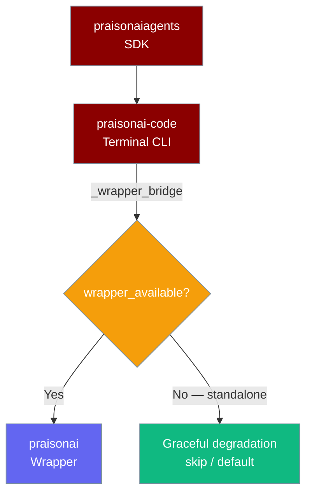

`praisonai-code` is the standalone code-execution agent runtime that sits between the core SDK (`praisonaiagents`) and the full wrapper (`praisonai`). It is not a GUI or a gateway — it is the engine that powers the `praisonai` CLI, packaged so you can use it without pulling in gateway, bots, or other wrapper integrations.


## Package Boundaries (C7.1)

`praisonai-code` sits between `praisonaiagents` (SDK) and `praisonai` (wrapper) — it never imports the wrapper at module load, and reaches wrapper-only features through a single bridge.

You can build an `Agent` and call `agent.start()` standalone; only gateway/bot serving needs the wrapper.



### Three-tier ownership

| Package | Owns | Must not depend on |
|---------|------|-------------------|
| `praisonaiagents` | Agent, tools, memory, hooks, framework **protocols** | `praisonai`, `praisonai-code` |
| `praisonai-code` | Terminal CLI: `run`/`chat`/`code`, Typer, runtime, llm, tool resolution | PyPI cycle on `praisonai` (lazy bridge only) |
| `praisonai` wrapper | Gateway, bots, serve orchestration, framework adapters, heavy integrations | — |

**Publish order:** `praisonaiagents` → `praisonai-code` → `praisonai`

### Wrapper bridge

The **only** sanctioned way for `praisonai-code` code to reach wrapper modules is through `praisonai_code._wrapper_bridge`. This makes standalone installs work — every wrapper call is guarded, so a missing `praisonai` package downgrades cleanly instead of raising `ImportError` at import time.

| Helper | Purpose |
|--------|---------|
| `wrapper_available()` | Probe if `praisonai` is importable — no side effects |
| `import_wrapper_module(name)` | Import a wrapper module (e.g. `"praisonai.framework_adapters.registry"`) with an install-hint error if missing |
| `get_wrapper_attr(module, attr)` | Fetch a wrapper attribute; raise with install hint if missing |
| `optional_wrapper_attr(module, attr, default)` | Fetch an attribute or return the supplied default — used by e.g. `recipe_creator.py` for graceful fallback |

---

## Quick Start

<Steps>
  <Step title="Install">
    ```bash
    pip install praisonai-code
    ```
    <Tip>
    For the full three-package overview and a "which package?" decision guide, see [Installation](/docs/installation).
    </Tip>
  </Step>

  <Step title="Set your API key">
    ```bash
    export OPENAI_API_KEY=your_openai_api_key
    ```
    Any supported provider key works (`ANTHROPIC_API_KEY`, `GEMINI_API_KEY`, `GROQ_API_KEY`, `OLLAMA_HOST`, …). See [Provider Auto-Detection](/docs/models#provider-auto-detection-no-config-first-run).
  </Step>

  <Step title="Run an agent">
    ```python
    from praisonaiagents import Agent

    agent = Agent(name="researcher", instructions="You are a helpful research assistant")
    response = agent.start("What are the latest advances in multimodal AI?")
    print(response)
    ```
  </Step>
</Steps>

---

## What ships in this package

`praisonai-code` v0.0.2 ships the `praisonai_code` Python package. It contains the full CLI implementation used by the `praisonai` wrapper command, plus the agent runtime modules.

| Module | Description |
|--------|-------------|
| `praisonai_code.cli` | Full CLI command tree (`run`, `chat`, `code`, `agent`, `agents`, `memory`, `tools`, `mcp`, `hooks`, and more) |
| `praisonai_code.cli.execution` | Core agent execution engine |
| `praisonai_code.cli.configuration` | Configuration loader and schema |
| `praisonai_code.cli.commands.*` | Individual CLI sub-commands |

<Note>
`praisonai-code` declares no `[project.scripts]` entry point of its own. The `praisonai` command you run is provided by the `praisonai` wrapper package, which imports its implementation from `praisonai_code`. When you install only `praisonai-code`, the runtime modules are available for import but you invoke them programmatically or via the `praisonai` binary if the wrapper is also installed.
</Note>

---

## What is not in this package

`praisonai-code` deliberately excludes the features that live in the `praisonai` wrapper:

- **Gateway** — messaging relay and session management ([docs](/docs/features/gateway))
- **Bots** — Telegram, Discord, Slack, WhatsApp integrations ([docs](/docs/features/bot-gateway))
- **YAML-driven multi-bot orchestration** — `praisonai onboard`, `praisonai setup`
- **Heavy optional integrations** — UI extras, CrewAI/AutoGen adapters

---

## When to pick this vs the wrapper vs the SDK

| Use case | Install |
|----------|---------|
| Run code-executing agents from a CLI without wrapper features | `pip install praisonai-code` |
| Deploy the full messaging/gateway stack | `pip install praisonai` |
| Embed agents in your own Python application | `pip install praisonaiagents` |

---

## Best Practices

<AccordionGroup>
  <Accordion title="Use simple imports">
    Always import from `praisonaiagents`, not from `praisonai_code` internals. The core SDK API is stable; internal CLI modules are implementation details.

    ```python
    from praisonaiagents import Agent, Task, PraisonAIAgents
    ```
  </Accordion>

  <Accordion title="Environment variables over code">
    Set API keys as environment variables rather than hardcoding them. `praisonai-code` reads the same environment variables as `praisonaiagents`.

    ```bash
    export OPENAI_API_KEY=your_openai_api_key
    python my_agent.py
    ```
  </Accordion>

  <Accordion title="Multi-agent patterns">
    `praisonai-code` inherits the full `praisonaiagents` multi-agent API:

    ```python
    from praisonaiagents import Agent, Task, PraisonAIAgents

    researcher = Agent(name="researcher", instructions="Research the topic")
    writer = Agent(name="writer", instructions="Write a summary")

    task1 = Task(description="Research AI trends", agent=researcher)
    task2 = Task(description="Summarise findings", agent=writer, context=[task1])

    agents = PraisonAIAgents(agents=[researcher, writer], tasks=[task1, task2])
    agents.start()
    ```
  </Accordion>

  <Accordion title="Upgrading to the full wrapper later">
    If you start with `praisonai-code` and later need gateway or bot features, just run `pip install praisonai`. Nothing in your existing code needs to change — the same `from praisonaiagents import Agent` imports still work.
  </Accordion>
</AccordionGroup>

---

## Related

<CardGroup cols={2}>
  <Card title="Installation Guide" icon="download" href="/docs/installation">
    Three-package comparison and decision guide
  </Card>
  <Card title="praisonai SDK" icon="wand-magic-sparkles" href="/docs/sdk/praisonai/index">
    Full wrapper with gateway and bots
  </Card>
  <Card title="praisonaiagents SDK" icon="robot" href="/docs/sdk/praisonaiagents/index">
    Core agent SDK
  </Card>
  <Card title="Quick Start" icon="bolt" href="/docs/quickstart">
    Build your first agent
  </Card>
</CardGroup>
