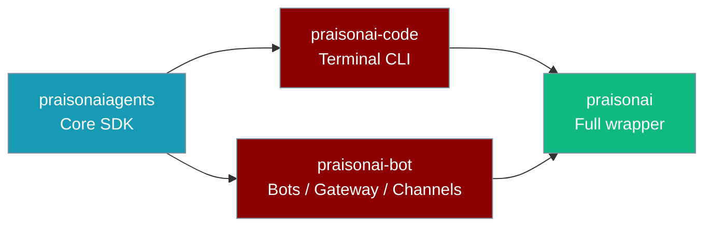
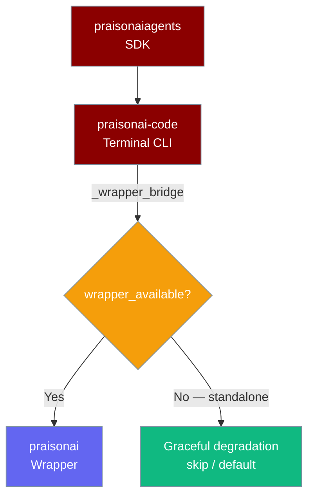

`praisonai-code` is the standalone code-execution agent runtime that sits between the core SDK (`praisonaiagents`) and the full wrapper (`praisonai`). It is not a GUI or a gateway — it is the engine that powers the `praisonai` CLI, packaged so you can use it without pulling in gateway, bots, or other wrapper integrations.



## Package Boundaries

`praisonai-code` sits in the four-tier package model between `praisonaiagents` (SDK) and `praisonai` (wrapper). It never imports the wrapper at module load, and reaches wrapper-only features through a single bridge (`praisonai_code._wrapper_bridge`). Its sibling `praisonai-bot` owns bots, gateway, channel CLI, and the gateway scheduler tick — see the [praisonai-bot SDK page](/docs/sdk/praisonai-bot/index).

You can build an `Agent` and call `agent.start()` standalone; only gateway/bot serving needs the wrapper.



### Four-tier ownership

| Package | Owns | Must not depend on |
|---------|------|-------------------|
| `praisonaiagents` | Agent, tools, memory, hooks, framework **protocols**, bot/gateway **protocols** | `praisonai`, `praisonai-code`, `praisonai-bot` |
| `praisonai-code` | Terminal CLI: `run`/`chat`/`code`, Typer, runtime, llm, tool resolution | PyPI cycle on `praisonai` (lazy `_wrapper_bridge` only) |
| `praisonai-bot` | Bots, gateway server, channel CLI, OS daemon, **gateway scheduler tick** | PyPI cycle on `praisonai` (lazy `_wrapper_bridge` + `_code_bridge` only) |
| `praisonai` wrapper | Framework adapters (CrewAI/AutoGen), train, serve, dashboard, async jobs API, `RunPolicy` safety gate | — |

**Publish order:** `praisonaiagents` → `praisonai-code` + `praisonai-bot` → `praisonai`

### Wrapper bridge

The **only** sanctioned way for `praisonai-code` code to reach wrapper modules is through `praisonai_code._wrapper_bridge`. This makes standalone installs work — every wrapper call is guarded, so a missing `praisonai` package downgrades cleanly instead of raising `ImportError` at import time.

| Helper | Purpose |
|--------|---------|
| `wrapper_available()` | Probe if `praisonai` is importable — no side effects |
| `import_wrapper_module(name)` | Import a wrapper module (e.g. `"praisonai.framework_adapters.registry"`) with an install-hint error if missing |
| `get_wrapper_attr(module, attr)` | Fetch a wrapper attribute; raise with install hint if missing |
| `optional_wrapper_attr(module, attr, default)` | Fetch an attribute or return the supplied default — used by e.g. `recipe_creator.py` for graceful fallback |

---

## Quick Start

<Steps>
  <Step title="Install">
    ```bash
    pip install praisonai-code
    ```
    <Tip>
    For the full four-package overview and a "which package?" decision guide, see [Installation](/docs/installation).
    </Tip>
  </Step>

  <Step title="Set your API key">
    ```bash
    export OPENAI_API_KEY=your_openai_api_key
    ```
    Any supported provider key works (`ANTHROPIC_API_KEY`, `GEMINI_API_KEY`, `GROQ_API_KEY`, `OLLAMA_HOST`, …). See [Provider Auto-Detection](/docs/models#provider-auto-detection-no-config-first-run).
  </Step>

  <Step title="Run an agent">
    ```python
    from praisonaiagents import Agent

    agent = Agent(name="researcher", instructions="You are a helpful research assistant")
    response = agent.start("What are the latest advances in multimodal AI?")
    print(response)
    ```
  </Step>
</Steps>

---

## What ships in this package

The `praisonai_code` Python package contains the terminal-native CLI and agent runtime. Current published versions are shown on the [installation page](/docs/installation). It contains the full CLI implementation used by the `praisonai` wrapper command, plus the agent runtime modules.

| Module | Description |
|--------|-------------|
| `praisonai_code.cli` | Full CLI command tree (`run`, `chat`, `code`, `agent`, `agents`, `memory`, `tools`, `mcp`, `hooks`, and more) |
| `praisonai_code.cli.execution` | Core agent execution engine |
| `praisonai_code.cli.configuration` | Configuration loader and schema |
| `praisonai_code.cli.commands.*` | Individual CLI sub-commands |

<Note>
`praisonai-code` installs a `praisonai-code` console script and a `python -m praisonai_code` module entrypoint. On a standalone install (no wrapper), `praisonai-code run --output actions|json|stream|stream-json "prompt"`, `daemon start`, `config`, and `doctor` work directly. On a standalone install, `praisonai-code doctor` returns exit 0 when core checks pass — wrapper-presence checks SKIP with an explicit "Install full wrapper: pip install praisonai" reason ([PR #2851](https://github.com/MervinPraison/PraisonAI/pull/2851)). Default `run "prompt"`, `chat`, and `code` require the wrapper — install with `pip install praisonai` to unlock them (a clear install hint is printed if you invoke them standalone). See the [Standalone limits](#standalone-limits) table below.
</Note>

### Standalone limits (`pip install praisonai-code` only)

| Command | Works standalone? | Notes |
|---------|-------------------|-------|
| `run --help`, `config`, `doctor` | Yes | |
| `run --output actions "…"` | Yes | In-process `Agent` (structured events preset) |
| `run --output json "…"` | Yes | In-process `Agent` (structured JSON output) |
| `run --output stream "…"` | Yes | In-process `Agent` (streaming text) |
| `run --output stream-json "…"` | Yes | In-process `Agent` (streaming JSON events) |
| `run "…"` (default) | Yes | In-process `Agent` (silent preset; prints final text) |
| `run --output plain/verbose/silent "…"` | Yes | In-process `Agent` (plain/verbose/silent presets) |
| `chat`, `code` | No | TUI / interactive legacy live in wrapper (`pip install praisonai`) |
| `daemon start` (foreground) | Yes | |
| `daemon start --background` | Yes | Spawns `python -m praisonai_code.runtime` |

For interactive terminal UX (`chat`, `code`), install the wrapper: `pip install praisonai`. Default `run` and every `--output` text mode work standalone in-process (PR #2853).

---

## What is not in this package

`praisonai-code` deliberately excludes the features that live in the `praisonai` wrapper:

- **Gateway** — messaging relay and session management. Install `praisonai-bot[gateway]` for the standalone gateway, or install the full `praisonai` wrapper. See [Standalone Bot Gateway](/docs/features/standalone-bot-gateway).
- **Bots** — Telegram, Discord, Slack, WhatsApp integrations. Install `praisonai-bot[bot]` for standalone channel bots.
- **Gateway scheduler tick** — scheduled agent execution. Lives in `praisonai-bot`; the `RunPolicy` safety gate stays wrapper-only.
- **YAML-driven multi-bot orchestration** — `praisonai onboard`, `praisonai setup` (wrapper).
- **Framework adapters** — CrewAI, AutoGen (wrapper).

---

## When to pick this vs the wrapper vs the SDK

| Use case | Install |
|----------|---------|
| Embed agents in your own Python application | `pip install praisonaiagents` |
| Run agents from a CLI with `run --output actions|json|stream|stream-json` / `daemon` only | `pip install praisonai-code` |
| Deploy a Telegram/Slack/Discord bot + gateway without the full wrapper | `pip install "praisonai-bot[gateway,bot]"` |
| Full terminal UX (`chat`, `code`, default `run`) + gateway + framework adapters | `pip install praisonai` |

---

## Best Practices

<AccordionGroup>
  <Accordion title="Use simple imports">
    Always import from `praisonaiagents`, not from `praisonai_code` internals. The core SDK API is stable; internal CLI modules are implementation details.

    ```python
    from praisonaiagents import Agent, Task, PraisonAIAgents
    ```
  </Accordion>

  <Accordion title="Environment variables over code">
    Set API keys as environment variables rather than hardcoding them. `praisonai-code` reads the same environment variables as `praisonaiagents`.

    ```bash
    export OPENAI_API_KEY=your_openai_api_key
    python my_agent.py
    ```
  </Accordion>

  <Accordion title="Multi-agent patterns">
    `praisonai-code` inherits the full `praisonaiagents` multi-agent API:

    ```python
    from praisonaiagents import Agent, Task, PraisonAIAgents

    researcher = Agent(name="researcher", instructions="Research the topic")
    writer = Agent(name="writer", instructions="Write a summary")

    task1 = Task(description="Research AI trends", agent=researcher)
    task2 = Task(description="Summarise findings", agent=writer, context=[task1])

    agents = PraisonAIAgents(agents=[researcher, writer], tasks=[task1, task2])
    agents.start()
    ```
  </Accordion>

  <Accordion title="Upgrading to the full wrapper later">
    If you start with `praisonai-code` and later need gateway or bot features, add `pip install "praisonai-bot[gateway,bot]"` for the standalone bot path, or `pip install praisonai` for the full wrapper. Nothing in your existing code needs to change — the same `from praisonaiagents import Agent` imports still work.
  </Accordion>
</AccordionGroup>

---

## Related

<CardGroup cols={2}>
  <Card title="Installation Guide" icon="download" href="/docs/installation">
    Three-package comparison and decision guide
  </Card>
  <Card title="praisonai SDK" icon="wand-magic-sparkles" href="/docs/sdk/praisonai/index">
    Full wrapper with gateway and bots
  </Card>
  <Card title="praisonaiagents SDK" icon="robot" href="/docs/sdk/praisonaiagents/index">
    Core agent SDK
  </Card>
  <Card title="Quick Start" icon="bolt" href="/docs/quickstart">
    Build your first agent
  </Card>
</CardGroup>
