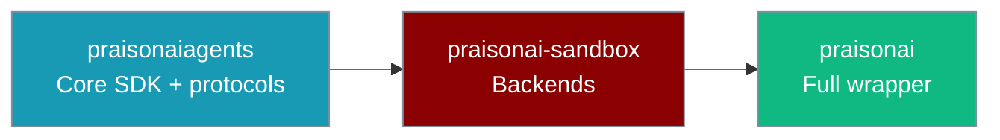

`praisonai-sandbox` is the standalone Tier-2 package that holds the sandbox backends extracted from the `praisonai` wrapper. Agents reach these backends through `SandboxManager`; you can also install the package on its own for a minimal, sandbox-only footprint.



## Quick Start

<Steps>
  <Step title="Install">
    ```bash
    pip install "praisonai-sandbox[docker]"
    ```
    <Tip>
    `pip install praisonai` already bundles `praisonai-sandbox` — install the standalone package only for sandbox-only environments.
    </Tip>
  </Step>

  <Step title="Import a backend">
    ```python
    from praisonai_sandbox import DockerSandbox
    from praisonaiagents.sandbox import SandboxConfig

    config = SandboxConfig.docker("python:3.11-slim")
    sandbox = DockerSandbox(image=config.image, config=config)
    ```
  </Step>
</Steps>

---

## Install Matrix

| Extra | Command | Pulls |
|-------|---------|-------|
| _(base)_ | `pip install praisonai-sandbox` | `praisonaiagents`, `rich`, `typer`, `click` |
| `docker` | `pip install "praisonai-sandbox[docker]"` | `docker>=7.0.0` |
| `e2b` | `pip install "praisonai-sandbox[e2b]"` | `e2b-code-interpreter>=1.0.0` |
| `sandlock` | `pip install "praisonai-sandbox[sandlock]"` | `sandlock>=0.1.0` |
| `ssh` | `pip install "praisonai-sandbox[ssh]"` | `asyncssh>=2.14.0` |
| `modal` | `pip install "praisonai-sandbox[modal]"` | `modal>=0.64.0` |
| `daytona` | `pip install "praisonai-sandbox[daytona]"` | _(no deps — backend stubbed)_ |
| `all` | `pip install "praisonai-sandbox[all]"` | all of the above except `daytona` |

---

## Public API

Import any backend from `praisonai_sandbox`. Backends are lazy-loaded, so importing one never imports the others.

```python
from praisonai_sandbox import (
    DockerSandbox,
    SubprocessSandbox,
    SandlockSandbox,
    SSHSandbox,
    ModalSandbox,
    DaytonaSandbox,
    E2BSandbox,
)
```

| Export | Backend | Typical use |
|--------|---------|-------------|
| `DockerSandbox` | `docker` | Container isolation for production |
| `SubprocessSandbox` | `subprocess` | Fast local development (default) |
| `SandlockSandbox` | `sandlock` | Hardened local sandbox (Landlock + seccomp) |
| `SSHSandbox` | `ssh` | Remote server execution |
| `ModalSandbox` | `modal` | Modal cloud sandboxes |
| `E2BSandbox` | `e2b` | E2B cloud code interpreter |
| `DaytonaSandbox` | `daytona` | **Not implemented** — use subprocess/docker/e2b |

---

## Console Script

The package installs a `praisonai-sandbox` console script that prints an install hint. The user-facing CLI remains `praisonai sandbox …`.

```bash
$ praisonai-sandbox --help
praisonai-sandbox: use praisonaiagents SandboxManager or import praisonai_sandbox backends.
Install extras: pip install praisonai-sandbox[docker,e2b,sandlock,ssh,modal]
```

---

## Backward Compatibility

The old `praisonai.sandbox` path still works through shims — prefer `praisonai_sandbox` in new code.

```python
# New (recommended)
from praisonai_sandbox import SubprocessSandbox

# Backward-compatible shim (still works)
from praisonai.sandbox import SubprocessSandbox
```

---

## Related

<CardGroup cols={2}>
  <Card title="praisonai-sandbox Package" icon="shield-halved" href="/docs/features/praisonai-sandbox-package">
    How-to guide, install matrix, and standalone usage
  </Card>
  <Card title="Sandbox" icon="shield-halved" href="/docs/features/sandbox">
    Agent-level `sandbox=True` and `SandboxConfig`
  </Card>
  <Card title="Sandbox Backends" icon="server" href="/docs/features/sandbox-backends">
    Backend selection and isolation levels
  </Card>
  <Card title="Installation Guide" icon="download" href="/docs/installation">
    Package comparison and decision guide
  </Card>
</CardGroup>
