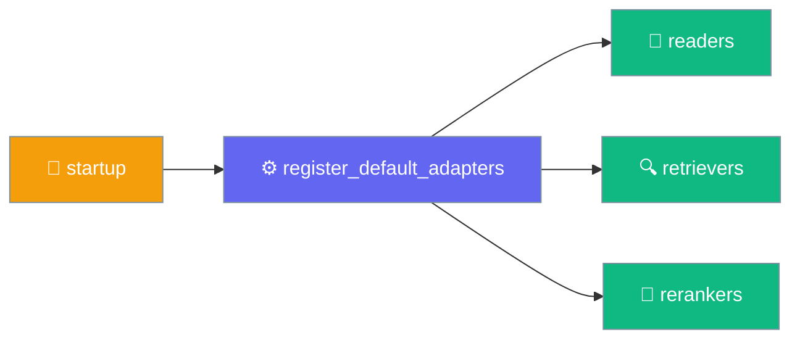

# Adapters Module

The Adapters module provides concrete implementations of knowledge base components including readers, vector stores, retrievers, and rerankers.

## Import

```python
from praisonai.adapters import (
    # Readers
    AutoReader, TextReader, MarkItDownReader, DirectoryReader,
    
    # Vector Stores
    ChromaVectorStore,
    
    # Retrievers
    BasicRetriever, FusionRetriever,
    
    # Rerankers
    LLMReranker
)
```

## Quick Example

```python
from praisonai.adapters import AutoReader, ChromaVectorStore, BasicRetriever

# Load documents
reader = AutoReader()
docs = reader.load("./documents/")

# Store in vector database
store = ChromaVectorStore(namespace="my_docs")
store.add(
    texts=[d.content for d in docs],
    embeddings=get_embeddings([d.content for d in docs]),
    metadatas=[d.metadata for d in docs]
)

# Retrieve
retriever = BasicRetriever(
    vector_store=store,
    embedding_fn=get_embedding
)
results = retriever.retrieve("search query", top_k=5)
```

## Registering the built-in adapters

`register_default_adapters()` is the single explicit entry point for wiring the wrapper's default readers, retrievers, and rerankers into the core-SDK registries.

```python
from praisonai.adapters import register_default_adapters

register_default_adapters()
```



<Note>
Prior to PraisonAI 4.6.156, importing `praisonai.adapters.readers` / `retrievers` / `rerankers` implicitly registered the defaults. Import is now side-effect-free — call `register_default_adapters()` (or the per-family helper) once at startup to wire them in.
</Note>

**Behaviour**

- Idempotent and thread-safe — subsequent calls are no-ops.
- Composite readers (`DirectoryReader.load`, `GlobReader.load`, `AutoReader.load`) auto-wire the built-in readers on first `.load()` call, so a reader-only workflow works without the explicit call. Retrievers and rerankers have no equivalent safety net — call `register_default_adapters()` if you look them up by name from the registry.
- `register_default_vector_stores()` is intentionally not wrapped in — it probes chromadb / pinecone on disk and stays opt-in.

**Per-family helpers** (unchanged, still importable):

```python
from praisonai.adapters.readers import register_default_readers
from praisonai.adapters.retrievers import register_default_retrievers
from praisonai.adapters.rerankers import register_default_rerankers
```

## Native async in custom retrievers / rerankers

`BasicRetriever.aretrieve()` and its siblings — plus every reranker's `arerank()` — offload the blocking body via `asyncio.to_thread(...)`, so calling them from inside an event loop no longer freezes it.

If you build a **custom** retriever or reranker on top of a natively-async provider (e.g. `cohere.AsyncClient`, an httpx `AsyncClient`), override the `async def` and `await` the native call directly — a `to_thread` hop over an already-async provider adds latency for no gain.

```python
from praisonai.adapters import BasicRetriever

class MyAsyncRetriever(BasicRetriever):
    async def aretrieve(self, query, top_k=None, filter=None, **kwargs):
        # Await the native-async provider directly — do NOT round-trip through asyncio.to_thread
        return await self._async_client.query(query, top_k=top_k)
```

## Features

- **Readers**: Load documents from files, directories, URLs, and glob patterns
- **Vector Stores**: Store and query document embeddings (ChromaDB, Pinecone)
- **Retrievers**: Find relevant documents (Basic, Fusion, Recursive, AutoMerge)
- **Rerankers**: Improve result relevance (LLM, CrossEncoder, Cohere)

## Module Structure

```
praisonai/adapters/
├── __init__.py          # Lazy loading exports
├── readers.py           # Document readers
├── vector_stores.py     # Vector store adapters
├── retrievers.py        # Retrieval strategies
└── rerankers.py         # Reranking implementations
```

## Available Components

### Readers

| Class | Description |
|-------|-------------|
| `AutoReader` | Automatic source detection and routing |
| `TextReader` | Plain text files (.txt, .log) |
| `MarkItDownReader` | Rich documents (PDF, DOCX, etc.) |
| `DirectoryReader` | Recursive directory loading |
| `GlobReader` | Glob pattern matching |
| `URLReader` | Web page content |

### Vector Stores

| Class | Description | Requirements |
|-------|-------------|--------------|
| `ChromaVectorStore` | Local persistent storage | `chromadb` |
| `PineconeVectorStore` | Cloud vector database | `pinecone` |

### Retrievers

| Class | Description |
|-------|-------------|
| `BasicRetriever` | Simple vector similarity |
| `FusionRetriever` | Multi-query with RRF |
| `RecursiveRetriever` | Depth-limited expansion |
| `AutoMergeRetriever` | Adjacent chunk merging |

### Rerankers

| Class | Description | Requirements |
|-------|-------------|--------------|
| `LLMReranker` | LLM-based scoring | OpenAI/Anthropic API |
| `CrossEncoderReranker` | Neural reranking | `sentence-transformers` |
| `CohereReranker` | Cohere Rerank API | `cohere` |

## Lazy Loading

All adapters use lazy loading to minimize import time:

```python
# Only loads when accessed
from praisonai.adapters import ChromaVectorStore  # Fast import

# Actual loading happens on first use
store = ChromaVectorStore()  # chromadb loaded here
```

## Example: Full RAG Pipeline

```python
from praisonai.adapters import (
    AutoReader,
    ChromaVectorStore,
    FusionRetriever,
    LLMReranker
)
from praisonaiagents import Agent

# 1. Load documents
reader = AutoReader()
docs = reader.load("./knowledge_base/")

# 2. Store with embeddings
store = ChromaVectorStore(namespace="kb")
store.add(
    texts=[d.content for d in docs],
    embeddings=get_embeddings([d.content for d in docs])
)

# 3. Create retriever with fusion
agent = Agent(instructions="Query assistant")
retriever = FusionRetriever(
    vector_store=store,
    embedding_fn=get_embedding,
    llm=agent,
    num_queries=3
)

# 4. Create reranker
reranker = LLMReranker(model="gpt-4o-mini")

# 5. Query pipeline
query = "How to deploy Python apps?"
results = retriever.retrieve(query, top_k=20)
reranked = reranker.rerank(query, [r.text for r in results], top_k=5)

for r in reranked:
    print(f"Score: {r.score:.3f} - {r.text[:100]}...")
```

## CLI Integration

The adapters power the `praisonai knowledge` CLI commands:

```bash
# Add documents (uses readers)
praisonai knowledge add ./docs/

# Query (uses vector store + retriever + reranker)
praisonai knowledge query "search query" \
  --vector-store chroma \
  --retrieval fusion \
  --reranker llm
```

## Related

- [Readers Module](/docs/sdk/praisonai/readers) - Document loading
- [Vector Store Module](/docs/sdk/praisonai/vector_store) - Vector storage
- [Retrieval Module](/docs/sdk/praisonai/retrieval) - Document retrieval
- [Reranker Module](/docs/sdk/praisonai/reranker) - Result reranking
