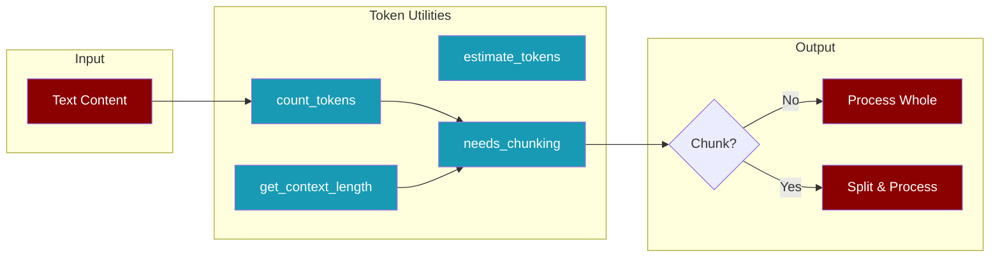
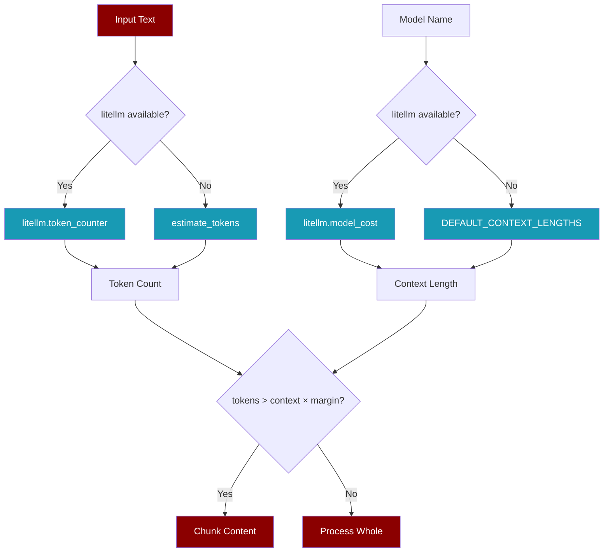

# Token Utilities

Lightweight token counting and context-aware chunking utilities. Works without external dependencies, with optional accuracy boost from `litellm`.



## Quick Start

<CodeGroup>
```python Basic Usage
from praisonaiagents.eval import estimate_tokens, needs_chunking

# Estimate tokens (no dependencies)
tokens = estimate_tokens("Hello world")
print(tokens)  # 2

# Check if chunking needed
if needs_chunking(large_text, model="gpt-4o-mini"):
    # Split into chunks
    pass
```

```python With Details
from praisonaiagents.eval import needs_chunking

# Get detailed chunking info
info = needs_chunking(
    text=my_content,
    model="gpt-4o-mini",
    safety_margin=0.8,
    return_info=True
)

print(f"Needs chunking: {info['needs_chunking']}")
print(f"Token count: {info['estimated_tokens']}")
print(f"Context window: {info['context_length']}")
print(f"Utilization: {info['utilization']:.1%}")
```
</CodeGroup>

## Functions

### estimate_tokens

Estimate token count without external dependencies.

<Tip>
Uses OpenAI's heuristics: ~4 characters per token, ~0.75 tokens per word.
</Tip>

```python
from praisonaiagents.eval import estimate_tokens

# Default (conservative - uses max of char/word methods)
tokens = estimate_tokens("Hello world")  # 2

# Character-based only
tokens = estimate_tokens("Hello world", method="chars")  # 2

# Word-based only  
tokens = estimate_tokens("Hello world", method="words")  # 2

# Average of both methods
tokens = estimate_tokens("Hello world", method="average")  # 2
```

<ParamField path="text" type="str" required>
  Text to estimate tokens for
</ParamField>

<ParamField path="method" type="str" default="max">
  Estimation method: `chars`, `words`, `max`, `min`, `average`
</ParamField>

### count_tokens

Count tokens accurately using `litellm` if available, otherwise estimate.

```python
from praisonaiagents.eval import count_tokens

# Uses litellm for accuracy (if installed)
tokens = count_tokens("Hello world", model="gpt-4o-mini")  # 2

# Force estimation (skip litellm)
tokens = count_tokens("Hello world", use_litellm=False)  # 2
```

<ParamField path="text" type="str" required>
  Text to count tokens for
</ParamField>

<ParamField path="model" type="str" default="gpt-4o-mini">
  Model name for tokenizer selection
</ParamField>

<ParamField path="use_litellm" type="bool" default="True">
  Whether to try litellm for accurate counting
</ParamField>

<Note>
For very large text (>100K chars), automatically falls back to estimation for performance.
</Note>

### get_context_length

Get the context window size for a model.

```python
from praisonaiagents.eval import get_context_length

# OpenAI models
print(get_context_length("gpt-4o-mini"))      # 128000
print(get_context_length("gpt-4o"))           # 128000

# Anthropic models
print(get_context_length("claude-3-5-sonnet-20241022"))  # 200000

# Google models
print(get_context_length("gemini-1.5-pro"))   # 2097152
```

<ParamField path="model" type="str" required>
  Model name (e.g., "gpt-4o-mini", "claude-3-5-sonnet-20241022")
</ParamField>

<ParamField path="use_litellm" type="bool" default="True">
  Whether to try litellm for accurate info
</ParamField>

<Accordion title="Supported Models">
| Model | Context Window |
|-------|---------------|
| gpt-4o | 128,000 |
| gpt-4o-mini | 128,000 |
| gpt-4-turbo | 128,000 |
| gpt-4 | 8,192 |
| gpt-3.5-turbo | 16,385 |
| o1 | 200,000 |
| o1-mini | 128,000 |
| claude-3-5-sonnet | 200,000 |
| claude-3-opus | 200,000 |
| gemini-1.5-pro | 2,097,152 |
| gemini-1.5-flash | 1,048,576 |
| mistral-large | 128,000 |
| deepseek-chat | 64,000 |
| llama-3.3-70b | 128,000 |
</Accordion>

### needs_chunking

Determine if text needs to be chunked for the given model.

```python
from praisonaiagents.eval import needs_chunking

# Simple check
if needs_chunking(large_text, "gpt-4o-mini"):
    print("Text too large, needs chunking")

# With custom safety margin (70% of context)
needs_chunk = needs_chunking(
    text=large_text,
    model="gpt-4o-mini",
    safety_margin=0.7
)

# Get detailed info
info = needs_chunking(large_text, "gpt-4o-mini", return_info=True)
# Returns: {
#   'needs_chunking': True,
#   'estimated_tokens': 150000,
#   'context_length': 128000,
#   'available_tokens': 102400,
#   'safety_margin': 0.8,
#   'utilization': 1.17
# }
```

<ParamField path="text" type="str" required>
  Text to evaluate
</ParamField>

<ParamField path="model" type="str" default="gpt-4o-mini">
  Model name to check context window for
</ParamField>

<ParamField path="safety_margin" type="float" default="0.8">
  Fraction of context window to use (leaves room for prompts)
</ParamField>

<ParamField path="return_info" type="bool" default="False">
  If True, return detailed info dict instead of bool
</ParamField>

### get_recommended_chunk_size

Get recommended chunk size in characters for a model.

```python
from praisonaiagents.eval import get_recommended_chunk_size

# Default (5 chunks)
chunk_size = get_recommended_chunk_size("gpt-4o-mini")  # ~10000

# More chunks for finer granularity
chunk_size = get_recommended_chunk_size("gpt-4o-mini", target_chunks=10)
```

<ParamField path="model" type="str" default="gpt-4o-mini">
  Model name
</ParamField>

<ParamField path="target_chunks" type="int" default="5">
  Target number of chunks
</ParamField>

<ParamField path="safety_margin" type="float" default="0.8">
  Fraction of context to use
</ParamField>

## CLI Integration

Use auto-chunking with the recipe judge command:

```bash
# Auto-detect if chunking is needed
praisonai recipe judge run-abc123 --auto-chunk

# Force chunked evaluation
praisonai recipe judge run-abc123 --chunked --chunk-size 8000
```

<Steps>
  <Step title="Run Recipe">
    Execute your recipe to generate a trace
  </Step>
  <Step title="Judge with Auto-Chunk">
    Use `--auto-chunk` to automatically handle large outputs
  </Step>
  <Step title="Review Results">
    Get accurate evaluation even for large content
  </Step>
</Steps>

## How It Works



<Accordion title="Token Estimation Heuristics">
Based on OpenAI's guidance for English text:
- **1 token ≈ 4 characters**
- **1 token ≈ 0.75 words**
- **100 tokens ≈ 75 words**

The `max` method (default) uses the larger of character-based and word-based estimates for conservative results.
</Accordion>

## Related

- [Eval Module](/docs/sdk/praisonaiagents/eval/eval) - Evaluation framework
- [Recipe Judge CLI](/docs/cli/eval) - CLI evaluation commands
