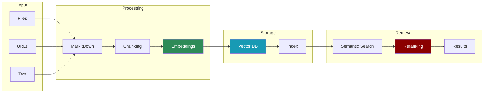

# Knowledge

RAG-powered knowledge management with document processing, vector storage, and semantic search.

## ✅ Quick Start

```python
from praisonaiagents import Agent

# Enable knowledge with file paths
agent = Agent(
    instructions="Answer questions using the knowledge base",
    knowledge=["docs/", "data.pdf"]
)

# Query the knowledge base
result = agent.query("What are the key findings?")
```

## ✅ Usage Forms Table

| Form | Example | When to Use |
|------|---------|-------------|
| **Bool** | `knowledge=True` | Enable with defaults |
| **List of sources** | `knowledge=["docs/", "file.pdf"]` | File paths/URLs |
| **String preset** | `knowledge="auto"` | Use predefined config |
| **Dict** | `knowledge={"sources": ["docs/"], "chunk_size": 512}` | Custom config |
| **Config instance** | `knowledge=KnowledgeConfig(...)` | Full control |

## ✅ Presets & Options

| Preset | Description |
|--------|-------------|
| `"auto"` | Auto-retrieve relevant context |

### Supported Sources

| Type | Example |
|------|---------|
| **Directory** | `"docs/"` |
| **File** | `"data.pdf"`, `"report.docx"` |
| **URL** | `"https://example.com/doc.pdf"` |

## ✅ Precedence Ladder

<Info>
**Resolution Order**: Instance > Config > Array > Dict > String > Bool > Default

When you pass `knowledge=`, the resolver checks in this order:
1. **Instance** - Knowledge instance? Use as-is
2. **Config** - KnowledgeConfig instance? Use as-is
3. **Array** - List of sources? Process as file paths/URLs
4. **Dict** - `{"key": value}`? Convert to config
5. **String** - Preset or single source? Look up or use as source
6. **Bool** - `True`? Use defaults. `False`? Disable
</Info>

## ✅ Classes

### Knowledge

| Method | Description |
|--------|-------------|
| `store(content, ...)` | Store raw text or file |
| `add(file_path, ...)` | Process and add files |
| `search(query, ...)` | Search with reranking |
| `get(memory_id)` | Retrieve by ID |
| `get_all(...)` | Retrieve all with filtering |
| `delete(memory_id)` | Delete specific |
| `reset()` | Clear all |

### Chunking Strategies

| Strategy | Description |
|----------|-------------|
| `"token"` | Split by token count |
| `"sentence"` | Split by sentences |
| `"recursive"` | Hierarchical splitting (default) |
| `"semantic"` | Semantic-aware splitting |

### CustomMemory
A specialized memory class that bypasses LLM usage for simple fact storage.

### Chunking
Unified interface for various text chunking strategies using the chonkie library.

#### Parameters
- `chunker_type: str = 'recursive'` - Type of chunking strategy
- `chunk_size: int = 512` - Maximum size of each chunk
- `chunk_overlap: int = 50` - Overlap between chunks
- `tokenizer: Optional[Any] = None` - Custom tokenizer (defaults to GPT-2)
- `embedding_model: Optional[Any] = None` - Embedding model for semantic chunking

#### Methods
- `chunk(text: str) → List[Chunk]` - Split text into chunks using configured strategy

## Configuration

### Vector Store Configuration
```python
config = {
    "vector_store": {
        "provider": "chroma",  # Options: chroma, qdrant, pinecone
        "config": {
            "collection_name": "my_knowledge",
            "path": ".praison",  # For local storage
            # Additional provider-specific options
        }
    },
    "embedder": {
        "provider": "openai",
        "config": {
            "model": "text-embedding-3-small"
        }
    }
}
```

### Chunking Strategies
#### 1. Token Chunker (`'token'`)
Splits text by token count with overlapping windows.

```python
chunker = Chunking(
    chunker_type='token',
    chunk_size=512,
    chunk_overlap=50
)
```

#### 2. Sentence Chunker (`'sentence'`)
Splits text by sentences while respecting chunk size.

```python
chunker = Chunking(
    chunker_type='sentence',
    chunk_size=512,
    chunk_overlap=50
)
```

#### 3. Recursive Chunker (`'recursive'`) - Default
Hierarchical splitting with multiple separators.

```python
chunker = Chunking(
    chunker_type='recursive',
    chunk_size=512
)
```

#### 4. Semantic Chunker (`'semantic'`)
Groups semantically similar content together.

```python
chunker = Chunking(
    chunker_type='semantic',
    chunk_size=512,
    embedding_model="sentence-transformers/all-MiniLM-L6-v2"
)
```

#### 5. SDPM Chunker (`'sdpm'`)
Semantic Double-Pass Merge for optimal chunking.

```python
chunker = Chunking(
    chunker_type='sdpm',
    chunk_size=512,
    embedding_model="sentence-transformers/all-MiniLM-L6-v2"
)
```

#### 6. Late Chunker (`'late'`)
Optimized for retrieval performance with late interaction.

```python
chunker = Chunking(
    chunker_type='late',
    chunk_size=512,
    embedding_model="sentence-transformers/all-MiniLM-L6-v2"
)
```

## Usage Examples

### Basic Knowledge Management
```python
from praisonaiagents import Knowledge

# Initialize knowledge base
knowledge = Knowledge(verbose=2)

# Add documents
knowledge.add("documents/manual.pdf")
knowledge.add("data/notes.txt")

# Store raw text
knowledge.store("Important fact: The API key is XYZ123")

# Search knowledge
results = knowledge.search("API key", limit=5)
for result in results:
    print(f"Score: {result['score']}, Content: {result['memory']}")
```

### Agent Integration
```python
from praisonaiagents import Agent

agent = Agent(
    name="Research Assistant",
    role="Knowledge expert",
    goal="Answer questions using knowledge base",
    knowledge=["research.pdf", "notes.txt"],  # Files to process
    knowledge_config={
        "vector_store": {
            "provider": "chroma",
            "config": {
                "collection_name": "research_kb"
            }
        }
    }
)
```

### Advanced Configuration
```python
# Configure with custom embeddings and chunking
config = {
    "vector_store": {
        "provider": "chroma",
        "config": {
            "collection_name": "advanced_kb",
            "path": "./knowledge_store"
        }
    },
    "embedder": {
        "provider": "openai",
        "config": {
            "model": "text-embedding-3-large"
        }
    }
}

knowledge = Knowledge(config=config, verbose=3)

# Use semantic chunking for better retrieval
knowledge.chunker = Chunking(
    chunker_type='semantic',
    chunk_size=1024,
    embedding_model="BAAI/bge-small-en-v1.5"
)
```

### Scoped Knowledge Retrieval
```python
# User-specific knowledge
user_results = knowledge.search(
    "project requirements",
    user_id="user123"
)

# Agent-specific knowledge
agent_results = knowledge.search(
    "conversation history",
    agent_id="support_agent"
)

# Session-specific knowledge
session_results = knowledge.search(
    "current task",
    run_id="session_456"
)
```

## Supported File Types
* **Documents**: PDF, DOC, DOCX, PPT, PPTX, XLS, XLSX
* **Text**: TXT, MD, CSV, JSON, XML, HTML
* **Images**: JPG, PNG, GIF, BMP, SVG
* **Audio**: MP3, WAV, M4A (transcription support)
* **Archives**: ZIP (planned)

## Performance Optimization
1. **Batch Processing** - Add multiple files in one call for efficiency
2. **Chunk Size** - Larger chunks for narrative content, smaller for technical
3. **Reranking** - Disable for faster search when precision isn't critical
4. **Embedding Cache** - Reuse embeddings for duplicate content

## Best Practices
1. **Choose Appropriate Chunking** - Semantic for varied content, recursive for structured
2. **Set Meaningful Metadata** - Use metadata for filtering and organization
3. **Regular Cleanup** - Delete outdated knowledge to maintain relevance
4. **Monitor Storage** - Check vector store size for large knowledge bases
5. **Test Retrieval Quality** - Verify search results match expectations
=======
title: "Knowledge"
sidebarTitle: "Knowledge"
description: "Knowledge base management and vector storage for RAG applications"
icon: "book"
---

## Overview

The Knowledge module provides powerful knowledge base management and vector storage capabilities for building RAG (Retrieval-Augmented Generation) applications. It supports multiple file formats, various chunking strategies, and semantic search with optional reranking.



## Quick Start

<Steps>
  <Step>
    Install praisonaiagents
    ```bash
    pip install praisonaiagents
    ```
  </Step>
  <Step>
    Import and initialize Knowledge
    ```python
    from praisonaiagents import Knowledge
    
    # Initialize knowledge base
    knowledge = Knowledge()
    
    # Add knowledge from various sources
    knowledge.add("path/to/document.pdf")
    knowledge.add("https://example.com/article")
    knowledge.add("Direct text content about AI")
    
    # Search the knowledge base
    results = knowledge.search("What is machine learning?")
    
    for result in results:
        print(f"Content: {result['text']}")
        print(f"Source: {result['source']}")
        print(f"Score: {result['score']}")
    ```
  </Step>
  <Step>
    Advanced configuration
    ```python
    from praisonaiagents import Knowledge
    
    # Configure with custom settings
    knowledge = Knowledge(
        collection_name="technical_docs",
        storage_path="./my_knowledge_base",
        chunk_size=512,
        chunk_overlap=50,
        chunking_strategy="semantic",
        embedding_model="all-MiniLM-L6-v2",
        use_reranking=True,
        reranking_model="ms-marco-MiniLM-L-6-v2"
    )
    
    # Add multiple documents
    docs = ["doc1.pdf", "doc2.md", "doc3.txt"]
    for doc in docs:
        knowledge.add(doc)
    
    # Search with custom limit
    results = knowledge.search(
        "explain neural networks",
        limit=10
    )
    ```
  </Step>
</Steps>

## Key Concepts

<Cards>
  <Card title="Multiple Formats" icon="file-lines">
    Support for PDFs, Word docs, Excel, images, web pages, and plain text
  </Card>
  <Card title="Smart Chunking" icon="scissors">
    Six different strategies: token, sentence, recursive, semantic, SDPM, and late chunking
  </Card>
  <Card title="Vector Storage" icon="database">
    ChromaDB backend with persistent storage and efficient retrieval
  </Card>
  <Card title="Semantic Search" icon="magnifying-glass">
    Embedding-based search with optional reranking for improved relevance
  </Card>
</Cards>

## API Reference

### Constructor

```python
Knowledge(
    collection_name: str = "knowledge_base",
    storage_path: Optional[str] = None,
    chunk_size: int = 1000,
    chunk_overlap: int = 200,
    chunking_strategy: str = "recursive",
    embedding_model: str = "all-MiniLM-L6-v2",
    use_reranking: bool = False,
    reranking_model: str = "ms-marco-MiniLM-L-6-v2"
)
```

#### Parameters

<ParamField path="collection_name" type="str" default="knowledge_base">
  Name of the ChromaDB collection
</ParamField>

<ParamField path="storage_path" type="Optional[str]">
  Path for persistent storage (defaults to `.praison/chroma_db`)
</ParamField>

<ParamField path="chunk_size" type="int" default="1000">
  Size of text chunks for processing
</ParamField>

<ParamField path="chunk_overlap" type="int" default="200">
  Overlap between consecutive chunks
</ParamField>

<ParamField path="chunking_strategy" type="str" default="recursive">
  Strategy for splitting text (see Chunking Strategies section)
</ParamField>

<ParamField path="embedding_model" type="str" default="all-MiniLM-L6-v2">
  Model for generating embeddings
</ParamField>

<ParamField path="use_reranking" type="bool" default="False">
  Whether to use reranking for search results
</ParamField>

<ParamField path="reranking_model" type="str" default="ms-marco-MiniLM-L-6-v2">
  Model for reranking search results
</ParamField>

### Methods

#### add()

Add content to the knowledge base from various sources.

```python
add(source: Union[str, Path]) -> bool
```

**Parameters:**
- `source` - File path, URL, or direct text content

**Returns:**
- `bool` - Success status

**Supported formats:**
- Documents: PDF, DOCX, PPTX
- Spreadsheets: XLSX, XLS, CSV
- Images: PNG, JPG, JPEG
- Web: HTML, URLs
- Text: TXT, MD, Python, JavaScript, etc.

#### search()

Search the knowledge base for relevant content.

```python
search(query: str, limit: int = 5) -> List[Dict[str, Any]]
```

**Parameters:**
- `query` - Search query
- `limit` - Maximum number of results

**Returns:**
- List of dictionaries containing:
  - `text` - Content chunk
  - `source` - Original source
  - `score` - Relevance score
  - `metadata` - Additional metadata

#### get_context()

Get formatted context for a query (useful for agents).

```python
get_context(query: str, max_results: int = 3) -> str
```

**Parameters:**
- `query` - Search query
- `max_results` - Maximum results to include

**Returns:**
- Formatted string with relevant context

#### clear()

Clear all content from the knowledge base.

```python
clear() -> None
```

#### get_stats()

Get statistics about the knowledge base.

```python
get_stats() -> Dict[str, Any]
```

**Returns:**
- Dictionary with:
  - `total_chunks` - Number of stored chunks
  - `sources` - List of unique sources
  - `collection_name` - Name of the collection
  - `storage_path` - Path to storage

## Chunking Strategies

The knowledge module supports multiple chunking strategies for different use cases:

<Tabs>
  <Tab title="Token-based">
    ```python
    knowledge = Knowledge(chunking_strategy="token")
    ```
    Splits text based on token count. Best for:
    - Consistent chunk sizes for LLM processing
    - Language model token limit management
  </Tab>
  
  <Tab title="Sentence-based">
    ```python
    knowledge = Knowledge(chunking_strategy="sentence")
    ```
    Splits at sentence boundaries. Best for:
    - Maintaining semantic completeness
    - Question-answering systems
  </Tab>
  
  <Tab title="Recursive">
    ```python
    knowledge = Knowledge(chunking_strategy="recursive")
    ```
    Hierarchical splitting with multiple separators. Best for:
    - General-purpose use (default)
    - Mixed content types
  </Tab>
  
  <Tab title="Semantic">
    ```python
    knowledge = Knowledge(chunking_strategy="semantic")
    ```
    Groups semantically similar sentences. Best for:
    - Maintaining topical coherence
    - Complex documents with multiple topics
  </Tab>
  
  <Tab title="SDPM">
    ```python
    knowledge = Knowledge(chunking_strategy="sdpm")
    ```
    Semantic Double-Pass Merging. Best for:
    - Academic papers
    - Technical documentation
  </Tab>
  
  <Tab title="Late Chunking">
    ```python
    knowledge = Knowledge(chunking_strategy="late_chunking")
    ```
    Embedding-aware chunking. Best for:
    - Maximum retrieval accuracy
    - When using specific embedding models
  </Tab>
</Tabs>

## Integration Examples

### With Agents

```python
from praisonaiagents import Agent, Knowledge

# Create knowledge base
knowledge = Knowledge()
knowledge.add("company_handbook.pdf")
knowledge.add("product_documentation.md")

# Create agent with knowledge
agent = Agent(
    name="DocAssistant",
    role="Documentation Expert",
    goal="Answer questions using the knowledge base",
    knowledge=knowledge
)

# Agent automatically uses knowledge for responses
response = agent.chat("What is our refund policy?")
```

### RAG Application

```python
from praisonaiagents import Agent, Task, Knowledge

# Build comprehensive knowledge base
knowledge = Knowledge(
    collection_name="tech_support",
    use_reranking=True
)

# Add multiple sources
sources = [
    "troubleshooting_guide.pdf",
    "faq.md",
    "https://docs.example.com/api",
    "Common issues:\n1. Login problems\n2. Performance issues"
]

for source in sources:
    knowledge.add(source)

# Create RAG agent
rag_agent = Agent(
    name="SupportBot",
    role="Technical Support AI",
    instructions=f"""You are a helpful support agent.
    Always search the knowledge base before answering.
    Cite your sources when providing information.""",
    knowledge=knowledge
)

# Create support task
task = Task(
    description="Help user with: {query}",
    agent=rag_agent,
    expected_output="Clear solution with source citations"
)
```

### Multi-Agent Knowledge Sharing

```python
from praisonaiagents import Knowledge, Agent, Agents

# Shared knowledge base
shared_kb = Knowledge(collection_name="shared_research")

# Add research papers
papers = ["paper1.pdf", "paper2.pdf", "review.pdf"]
for paper in papers:
    shared_kb.add(paper)

# Create multiple agents sharing knowledge
researcher = Agent(
    name="Researcher",
    role="Research Analyst",
    knowledge=shared_kb
)

writer = Agent(
    name="Writer",
    role="Technical Writer",
    knowledge=shared_kb
)

reviewer = Agent(
    name="Reviewer",
    role="Peer Reviewer",
    knowledge=shared_kb
)

# All agents can access the same knowledge
```

### Custom Processing Pipeline

```python
from praisonaiagents import Knowledge
import logging

class CustomKnowledge(Knowledge):
    def process_before_adding(self, text: str, source: str) -> str:
        """Custom preprocessing"""
        # Clean text
        text = text.strip()
        
        # Add source header
        text = f"Source: {source}\n\n{text}"
        
        # Log processing
        logging.info(f"Processing {source}")
        
        return text
    
    def filter_search_results(self, results: list) -> list:
        """Custom result filtering"""
        # Filter out low-score results
        filtered = [r for r in results if r['score'] > 0.7]
        
        # Sort by score
        filtered.sort(key=lambda x: x['score'], reverse=True)
        
        return filtered

# Use custom knowledge
kb = CustomKnowledge(
    chunk_size=500,
    use_reranking=True
)
```

## Best Practices

<CardGroup cols={2}>
  <Card title="Document Preparation" icon="file-pen">
    - **Clean documents** before adding (remove headers/footers if needed)
    - **Use appropriate formats** - PDF for formatted docs, MD for technical docs
    - **Structure content** with clear headings and sections
    - **Include metadata** in document names or content
  </Card>
  
  <Card title="Chunking Strategy" icon="scissors">
    - **Token-based**: When working with token-limited LLMs
    - **Sentence-based**: For Q&A systems needing complete thoughts
    - **Recursive**: General purpose, good default choice
    - **Semantic**: For documents with multiple distinct topics
    - **SDPM**: For academic or highly structured content
    - **Late chunking**: When retrieval accuracy is critical
  </Card>
  
  <Card title="Search Optimization" icon="magnifying-glass-chart">
    - **Use reranking** for better relevance in large knowledge bases
    - **Tune chunk size** - smaller for precise retrieval, larger for context
    - **Optimize queries** - use clear, specific search terms
    - **Limit results** appropriately to balance relevance and coverage
  </Card>
  
  <Card title="Storage Management" icon="database">
    - **Use meaningful collection names** for different knowledge domains
    - **Implement cleanup strategies** for growing knowledge bases
    - **Monitor storage size** and implement archival if needed
    - **Backup important collections** regularly
  </Card>
</CardGroup>

## Performance Considerations

### Embedding Models

The choice of embedding model affects both quality and performance:

<Table>
  <TableHeader>
    <TableRow>
      <TableHeaderCell>Model</TableHeaderCell>
      <TableHeaderCell>Quality</TableHeaderCell>
      <TableHeaderCell>Speed</TableHeaderCell>
      <TableHeaderCell>Use Case</TableHeaderCell>
    </TableRow>
  </TableHeader>
  <TableBody>
    <TableRow>
      <TableCell>all-MiniLM-L6-v2</TableCell>
      <TableCell>Good</TableCell>
      <TableCell>Fast</TableCell>
      <TableCell>Default, balanced performance</TableCell>
    </TableRow>
    <TableRow>
      <TableCell>all-mpnet-base-v2</TableCell>
      <TableCell>Excellent</TableCell>
      <TableCell>Medium</TableCell>
      <TableCell>Higher quality requirements</TableCell>
    </TableRow>
    <TableRow>
      <TableCell>all-MiniLM-L12-v2</TableCell>
      <TableCell>Fair</TableCell>
      <TableCell>Very Fast</TableCell>
      <TableCell>Speed-critical applications</TableCell>
    </TableRow>
    <TableRow>
      <TableCell>Custom models</TableCell>
      <TableCell>Varies</TableCell>
      <TableCell>Varies</TableCell>
      <TableCell>Domain-specific content</TableCell>
    </TableRow>
  </TableBody>
</Table>

### Reranking Impact

```python
# Without reranking - faster
knowledge = Knowledge(use_reranking=False)
results = knowledge.search("query")  # ~50ms

# With reranking - more accurate
knowledge = Knowledge(use_reranking=True)
results = knowledge.search("query")  # ~200ms
```

### Scaling Considerations

For large knowledge bases:

1. **Use appropriate chunk sizes** - Larger chunks reduce total count
2. **Implement batch processing** for adding multiple documents
3. **Consider sharding** collections by domain or time period
4. **Monitor memory usage** with embedding models
5. **Use persistent storage** to avoid reprocessing

## Troubleshooting

Common issues and solutions:

<Accordion>
  <AccordionItem title="Out of memory">
    Reduce chunk size or process documents in batches
  </AccordionItem>
  <AccordionItem title="Slow search">
    Disable reranking or reduce search limit
  </AccordionItem>
  <AccordionItem title="Poor relevance">
    Try different chunking strategies or embedding models
  </AccordionItem>
  <AccordionItem title="Storage errors">
    Check disk space and permissions
  </AccordionItem>
  <AccordionItem title="Format not supported">
    Convert to supported format or use URL/text input
  </AccordionItem>
</Accordion>

## Complete Example

```python
from praisonaiagents import Knowledge, Agent, Task, Agents
import os

# Initialize knowledge base with optimal settings
knowledge = Knowledge(
    collection_name="customer_support",
    storage_path="./support_kb",
    chunk_size=512,
    chunk_overlap=50,
    chunking_strategy="recursive",
    use_reranking=True
)

# Add various knowledge sources
print("Building knowledge base...")

# Documentation
for doc in os.listdir("./docs"):
    if doc.endswith(('.pdf', '.md', '.txt')):
        knowledge.add(f"./docs/{doc}")
        print(f"Added: {doc}")

# FAQs from web
knowledge.add("https://example.com/faq")

# Direct knowledge
knowledge.add("""
Customer Support Best Practices:
1. Always greet customers warmly
2. Listen actively to understand the issue
3. Search knowledge base before responding
4. Provide clear, step-by-step solutions
5. Follow up to ensure resolution
""")

# Create support agent
support_agent = Agent(
    name="CustomerSupport",
    role="Senior Support Specialist",
    goal="Resolve customer issues using knowledge base",
    backstory="Expert support agent with deep product knowledge",
    knowledge=knowledge,
    
)

# Create escalation agent
escalation_agent = Agent(
    name="EscalationSupport",
    role="Support Manager",
    goal="Handle complex issues that need escalation",
    knowledge=knowledge
)

# Define tasks
initial_support = Task(
    description="Help customer with: {customer_query}",
    agent=support_agent,
    expected_output="Solution or escalation decision"
)

escalation_task = Task(
    description="Handle escalated issue: {issue_details}",
    agent=escalation_agent,
    expected_output="Advanced solution or workaround"
)

# Create workflow
workflow = Agents(
    agents=[support_agent, escalation_agent],
    tasks=[initial_support, escalation_task],
    process="sequential"
)

# Test the system
test_queries = [
    "How do I reset my password?",
    "The app crashes when I upload large files",
    "Can I get a refund for my subscription?"
]

for query in test_queries:
    print(f"\nQuery: {query}")
    
    # Search knowledge directly
    results = knowledge.search(query, limit=3)
    print(f"Found {len(results)} relevant articles")
    
    # Get agent response
    response = support_agent.chat(query)
    print(f"Response: {response}")

# Get knowledge base statistics
stats = knowledge.get_stats()
print(f"\nKnowledge Base Stats:")
print(f"Total chunks: {stats['total_chunks']}")
print(f"Sources: {len(stats['sources'])}")
```
