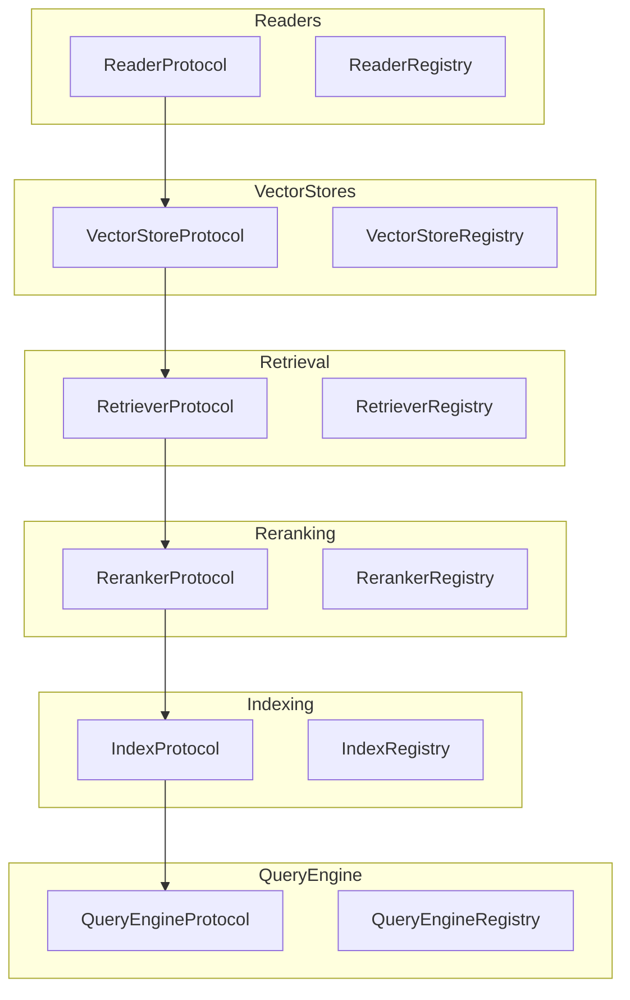

# Knowledge Stack Protocols

The knowledge stack provides a modular, protocol-based architecture for building RAG (Retrieval-Augmented Generation) applications. Each component follows a protocol pattern with registries for extensibility.

## Architecture Overview



## Data Classes

### Document

```python
from praisonaiagents.knowledge import Document

doc = Document(
    content="Hello world",
    metadata={"source": "test.txt", "page": 1},
    doc_id="doc-123",
    embedding=[0.1, 0.2, 0.3]  # Optional
)

# Serialization
doc_dict = doc.to_dict()
doc_restored = Document.from_dict(doc_dict)
```

### VectorRecord

```python
from praisonaiagents.knowledge import VectorRecord

record = VectorRecord(
    id="vec-123",
    text="Document content",
    embedding=[0.1, 0.2, 0.3],
    metadata={"source": "file.pdf"},
    score=0.95  # Optional, from query results
)
```

### RetrievalResult

```python
from praisonaiagents.knowledge import RetrievalResult

result = RetrievalResult(
    text="Retrieved content",
    score=0.92,
    metadata={"source": "doc.pdf"},
    doc_id="doc-123",
    chunk_index=5
)
```

### RerankResult

```python
from praisonaiagents.knowledge import RerankResult

result = RerankResult(
    text="Reranked content",
    score=0.98,
    original_index=2,
    metadata={}
)
```

### QueryResult

```python
from praisonaiagents.knowledge import QueryResult

result = QueryResult(
    answer="The answer based on context",
    sources=[{"text": "Source 1", "score": 0.9}],
    sub_questions=["What is X?", "What is Y?"],
    metadata={"mode": "sub_question"}
)
```

## Enums

### RetrievalStrategy

```python
from praisonaiagents.knowledge import RetrievalStrategy

RetrievalStrategy.BASIC       # Simple vector similarity
RetrievalStrategy.FUSION      # Multi-query with RRF
RetrievalStrategy.RECURSIVE   # Depth-limited recursive
RetrievalStrategy.AUTO_MERGE  # Merge adjacent chunks
RetrievalStrategy.HYBRID      # Vector + keyword
```

### IndexType

```python
from praisonaiagents.knowledge import IndexType

IndexType.VECTOR   # Vector similarity index
IndexType.KEYWORD  # BM25 keyword index
IndexType.HYBRID   # Combined vector + keyword
IndexType.GRAPH    # Graph-based index
```

### QueryMode

```python
from praisonaiagents.knowledge import QueryMode

QueryMode.DEFAULT       # Standard RAG query
QueryMode.SUB_QUESTION  # Decompose complex questions
QueryMode.SQL           # SQL query generation
QueryMode.ROUTER        # Route to appropriate handler
QueryMode.SUMMARIZE     # Summarize retrieved context
```

## Vector Store Protocol

### InMemoryVectorStore

Built-in in-memory vector store for testing and simple use cases.

```python
from praisonaiagents.knowledge.vector_store import InMemoryVectorStore

store = InMemoryVectorStore()

# Add vectors
ids = store.add(
    texts=["Hello world", "Goodbye world"],
    embeddings=[[0.1, 0.2], [0.3, 0.4]],
    metadatas=[{"source": "a"}, {"source": "b"}]
)

# Query by similarity
results = store.query(
    embedding=[0.1, 0.2],
    top_k=5,
    filter={"source": "a"}
)

# Delete
store.delete(ids=ids)
store.delete(filter={"source": "a"})
store.delete(delete_all=True)

# Get by ID
records = store.get(ids=["id1", "id2"])

# Count
count = store.count()
```

### Registry

```python
from praisonaiagents.knowledge import get_vector_store_registry

registry = get_vector_store_registry()

# List available stores
stores = registry.list_stores()  # ['memory']

# Get a store
store = registry.get("memory")

# Register custom store
registry.register("custom", MyCustomStore)
```

## Retrieval Strategies

### Reciprocal Rank Fusion

```python
from praisonaiagents.knowledge.retrieval import reciprocal_rank_fusion

# Fuse results from multiple queries
list1 = [RetrievalResult(text="A", score=0.9, doc_id="1")]
list2 = [RetrievalResult(text="A", score=0.8, doc_id="1")]

fused = reciprocal_rank_fusion([list1, list2], k=60)
```

### Merge Adjacent Chunks

```python
from praisonaiagents.knowledge.retrieval import merge_adjacent_chunks

results = [
    RetrievalResult(text="Part 1", score=0.9, doc_id="1", chunk_index=0),
    RetrievalResult(text="Part 2", score=0.8, doc_id="1", chunk_index=1),
]

merged = merge_adjacent_chunks(results, max_gap=1)
```

## Reranker Protocol

### SimpleReranker

Built-in keyword-based reranker.

```python
from praisonaiagents.knowledge.rerankers import SimpleReranker

reranker = SimpleReranker()

results = reranker.rerank(
    query="Python programming",
    documents=["Python is great", "Java is different", "Python tutorial"],
    top_k=2
)

for r in results:
    print(f"{r.text}: {r.score}")
```

## Index Protocol

### KeywordIndex (BM25)

Built-in BM25 keyword index.

```python
from praisonaiagents.knowledge.index import KeywordIndex

index = KeywordIndex()

# Add documents
ids = index.add_documents(
    texts=["Python programming", "Machine learning"],
    metadatas=[{"type": "tutorial"}, {"type": "guide"}]
)

# Query
results = index.query("Python", top_k=5)

# Get stats
stats = index.stats()
print(f"Documents: {stats.document_count}, Tokens: {stats.total_tokens}")
```

## Query Engine Protocol

### SimpleQueryEngine

```python
from praisonaiagents.knowledge.query_engine import SimpleQueryEngine

engine = SimpleQueryEngine()

result = engine.query(
    "What is Python?",
    context=["Python is a programming language."]
)

print(result.answer)
print(result.sources)
```

### SubQuestionEngine

Decomposes complex questions into sub-questions.

```python
from praisonaiagents.knowledge.query_engine import SubQuestionEngine

engine = SubQuestionEngine()

result = engine.query(
    "What is Python and how to install it?",
    context=["Python is a language.", "Install with pip."]
)

print(result.sub_questions)  # ['What is Python?', 'How to install Python?']
print(result.answer)
```

### Question Decomposition

```python
from praisonaiagents.knowledge.query_engine import decompose_question

questions = decompose_question("What is X and what is Y?")
# ['What is X?', 'What is Y?']
```

## Agent Integration

```python
from praisonaiagents import Agent

agent = Agent(
    name="Knowledge Agent",
    instructions="Answer questions using the knowledge base",
    knowledge=["docs/manual.pdf", "data/faq.txt"],
    knowledge={
        "vector_store": {
            "provider": "chroma",
            "config": {"collection_name": "my_kb"}
        }
    }
)

response = agent.chat("How do I authenticate?")
```

## Related

- [Knowledge Class](/docs/sdk/praisonaiagents/knowledge/knowledge)
- [Knowledge CLI](/docs/cli/knowledge)
- [Memory Module](/docs/sdk/praisonaiagents/memory/memory)
