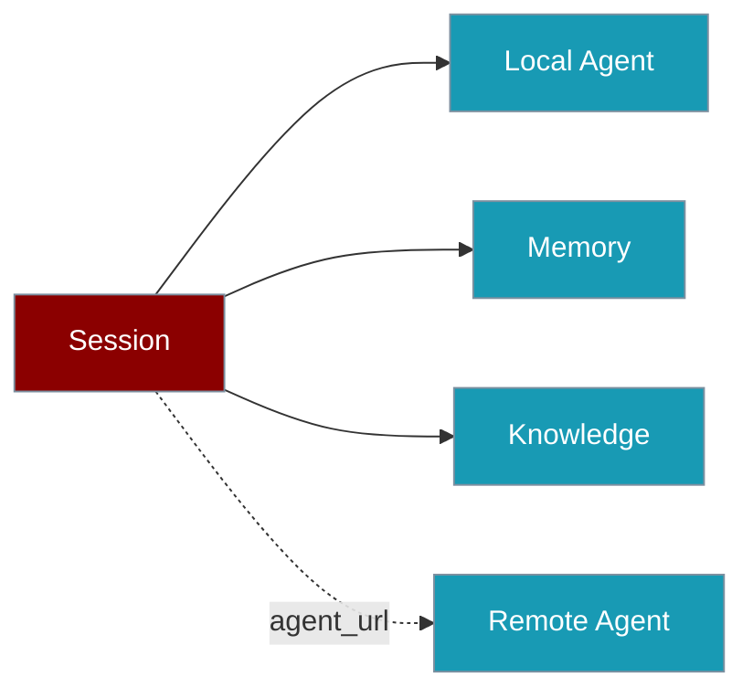

The `Session` wrapper keeps state, memory, and knowledge in one place for local agents or remote HTTP endpoints.


```mermaid
flowchart LR
    S[Session] --> A[Local Agent]
    S --> M[Memory]
    S --> K[Knowledge]
    S -.->|agent_url| R[Remote Agent]

    classDef agent fill:#8B0000,stroke:#7C90A0,color:#fff
    classDef process fill:#189AB4,stroke:#7C90A0,color:#fff

    class S agent
    class A,R process
    class M,K process
```

## Quick Start

```python
from praisonaiagents import Session

session = Session(session_id="chat_123", user_id="user_456")

agent = session.Agent(
    name="Assistant",
    instructions="Remember our conversation history",
)

response = agent.chat("Hello! I prefer Python.")
print(response)

session.save_state({"user_preference": "Python"})
```

## Constructor

```python
Session(
    session_id: Optional[str] = None,        # auto uuid4()[:8] if None
    user_id: Optional[str] = None,            # defaults to "default_user"
    agent_url: Optional[str] = None,          # http:// auto-prefixed if missing
    memory_config: Optional[Dict[str, Any]] = None,
    knowledge_config: Optional[Dict[str, Any]] = None,
    timeout: int = 30,
    session_ttl: Optional[int] = None,       # ValueError if negative
)
```

| Parameter | Description |
|---|---|
| `session_id` | Unique session identifier; auto-generated when omitted |
| `user_id` | User scope for memory operations |
| `agent_url` | Remote agent URL (enables remote mode) |
| `memory_config` | Memory backend config (local sessions only) |
| `knowledge_config` | Knowledge backend config (local sessions only) |
| `timeout` | HTTP timeout for remote calls (seconds) |
| `session_ttl` | Optional expiry in seconds |

## State & Memory

```python
session.set_state("score", 10)
session.increment_state("score", increment=5)

session.add_memory("User prefers concise answers", memory_type="long")
results = session.search_memory("preferences")
context = session.get_context("What does the user prefer?")

session.add_knowledge("docs/guide.pdf")
```

| Method | Purpose |
|---|---|
| `save_state` / `restore_state` | Persist arbitrary dict state |
| `get_state` / `set_state` | Single key access |
| `increment_state` | Atomic numeric counter helper |
| `add_memory` / `search_memory` / `clear_memory` | Session-scoped memory |
| `add_knowledge` / `search_knowledge` | Knowledge base (local only) |
| `get_context` | Build prompt context from memory |

## Session Lifecycle

```python
session = Session(session_id="ttl-demo", session_ttl=3600)

if session.is_expired():
    print("Session expired")

remaining = session.time_to_expiry()  # seconds, or None

session.close()  # saves agent histories and releases resources
```

Remote sessions call `_test_remote_connection()` during init — connection failures raise before you chat.

## Remote Sessions

```python
session = Session(
    agent_url="192.168.1.10:8000/agent",
    session_id="remote_chat",
    timeout=30,
)

print(session.chat("Hello from a remote client"))
```

Memory and knowledge operations are unavailable in remote mode — run them on the agent server instead.

## Related

<CardGroup cols={2}>
  <Card title="Session Persistence" icon="floppy-disk" href="/features/session-persistence">
    Agent `memory={"session_id": ...}` path
  </Card>
  <Card title="Session Store" icon="database" href="/features/session-store">
    Pluggable backends and hierarchical sessions
  </Card>
</CardGroup>
