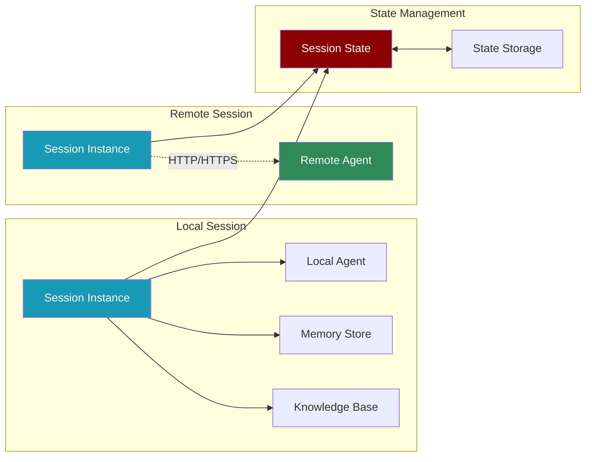

# Module praisonaiagents.session

The session module provides high-level abstractions for building stateful AI applications with persistent memory, knowledge management, and support for both local and remote agent connectivity.

## Classes

### Session
The main class for managing stateful agent sessions with integrated memory and knowledge systems.

#### Parameters
- `session_id: str` - Unique identifier for the session
- `user_id: str = "default"` - User identifier for multi-user support
- `remote_url: Optional[str] = None` - URL for remote agent connectivity
- `api_key: Optional[str] = None` - API key for remote authentication
- `auto_save: bool = True` - Automatically save state changes
- `storage_path: str = ".praison/sessions"` - Base path for session storage
- `memory_config: Optional[Dict[str, Any]] = None` - Memory system configuration
- `knowledge_config: Optional[Dict[str, Any]] = None` - Knowledge system configuration

#### Properties
- `memory` - Lazy-loaded Memory instance
- `knowledge` - Lazy-loaded Knowledge instance
- `session_dir` - Directory path for session data
- `is_remote` - Whether operating in remote mode

#### State Management Methods
- `save_state(data: Dict[str, Any])` - Save arbitrary state data
- `restore_state() → Dict[str, Any]` - Restore saved state
- `get_state(key: str, default=None)` - Get specific state value
- `set_state(key: str, value: Any)` - Set specific state value
- `clear_state()` - Clear all state data

#### Memory Methods
- `store_short_memory(content: str)` - Store in short-term memory
- `store_long_memory(content: str, quality_score: float = 0.7)` - Store in long-term memory
- `search_memory(query: str, memory_type: str = "all", limit: int = 5)` - Search memories
- `get_memory_context(query: str, max_items: int = 3)` - Build context from memory

#### Knowledge Methods
- `add_knowledge(source: str)` - Add knowledge from file or URL
- `search_knowledge(query: str, limit: int = 5)` - Search knowledge base
- `clear_knowledge()` - Clear knowledge base

#### Agent Methods
- `Agent(**kwargs)` - Create agent with session context (recommended)
- `create_agent(**kwargs)` - Legacy method for agent creation
- `test_remote_connection()` - Test remote agent connectivity

## Usage Examples

### Basic Session Management
```python
from praisonaiagents import Session

# Create a new session
session = Session(session_id="customer_support_123")

# Save state
session.save_state({
    "customer_name": "John Doe",
    "ticket_id": "SUP-456",
    "priority": "high"
})

# Retrieve state
state = session.restore_state()
print(f"Handling ticket {state['ticket_id']} for {state['customer_name']}")
```

### Stateful Agent with Memory
```python
# Create session with memory configuration
session = Session(
    session_id="assistant_session",
    memory={
        "provider": "rag",
        "use_embedding": True
    }
)

# Create agent with session context
agent = session.Agent(
    name="Personal Assistant",
    role="Helpful AI assistant",
    instructions="Remember user preferences and past conversations"
)

# Memory is automatically managed
response = agent.chat("My favorite color is blue")
session.store_long_memory("User's favorite color: blue", quality_score=0.9)

# Later retrieval
context = session.get_memory_context("What's my favorite color?")
```

### Knowledge-Enhanced Session
```python
# Initialize session with knowledge
session = Session(
    session_id="research_assistant",
    knowledge={
        "vector_store": {
            "provider": "chroma",
            "config": {
                "collection_name": "research_docs"
            }
        }
    }
)

# Add knowledge sources
session.add_knowledge("research_paper.pdf")
session.add_knowledge("https://example.com/article")

# Create knowledge-aware agent
agent = session.Agent(
    name="Research Assistant",
    role="Academic researcher",
    instructions="Use the knowledge base to answer questions"
)

# Knowledge is automatically searched during chat
response = agent.chat("What are the key findings?")
```

### Remote Agent Connection
```python
# Connect to remote agent
session = Session(
    session_id="remote_session",
    remote_url="https://api.example.com/agent",
    api_key="your-api-key"
)

# Test connection
if session.test_remote_connection():
    print("Connected to remote agent")
    
    # Remote chat
    response = session.chat("Hello from remote client")
else:
    print("Failed to connect")
```

### Multi-User Sessions
```python
# User-specific session
session = Session(
    session_id="app_main",
    user_id="user_123"
)

# User preferences
session.set_state("theme", "dark")
session.set_state("language", "en")

# User-specific memory
session.store_long_memory(
    "User prefers technical explanations",
    quality_score=0.8
)

# Create personalized agent
agent = session.Agent(
    name="User Assistant",
    instructions=f"User {session.user_id} prefers {session.get_state('theme')} theme"
)
```

### Session Restoration
```python
# Original session
session1 = Session(session_id="project_alpha")
session1.save_state({"progress": 75, "phase": "testing"})
session1.store_long_memory("Completed unit tests successfully")

# Later restoration
session2 = Session(session_id="project_alpha")  # Same ID
state = session2.restore_state()
print(f"Project progress: {state['progress']}%")

# Memory persists
memories = session2.search_memory("unit tests")
```

### State Management Patterns
```python
# Incremental state updates
session = Session(session_id="game_session")

# Initialize state
session.save_state({
    "score": 0,
    "level": 1,
    "inventory": []
})

# Update specific values
session.set_state("score", session.get_state("score", 0) + 10)

# Complex state updates
inventory = session.get_state("inventory", [])
inventory.append("sword")
session.set_state("inventory", inventory)
=======
title: "Session Management"
sidebarTitle: "Session"
description: "Build stateful applications with persistent sessions and remote agent connectivity"
icon: "server"
---



## Overview

The Session module provides a unified API for building stateful agent applications with persistent state management and remote agent connectivity. It acts as a simple wrapper around PraisonAI's existing stateful capabilities, making it easy to:

- Create persistent sessions with unique identifiers
- Manage agent state across multiple interactions
- Connect to remote agents running on different machines
- Store and retrieve memory and knowledge within session context
- Build distributed agent systems similar to Google's ADK pattern

## Quick Start

<Tabs>
  <Tab title="Local Session">
    <Steps>
      <Step>
        Install with memory support
        ```bash
        pip install "praisonaiagents[memory]"
        ```
      </Step>
      <Step>
        Create a local session
        ```python
        from praisonaiagents import Session
        
        # Create a local session
        session = Session(
            session_id="chat_123",
            user_id="user_456"
        )
        
        # Create an agent within the session
        agent = session.Agent(
            name="Assistant",
            role="Helpful AI",
            instructions="Remember our conversation history"
        )
        
        # Chat with the agent
        response = agent.chat("Hello! Please remember I prefer Python.")
        print(response)
        
        # Save session state
        session.save_state({
            "conversation_topic": "Python programming",
            "user_preference": "Python"
        })
        ```
      </Step>
    </Steps>
  </Tab>
  
  <Tab title="Remote Session">
    <Steps>
      <Step>
        Install praisonaiagents
        ```bash
        pip install praisonaiagents
        ```
      </Step>
      <Step>
        Connect to remote agent
        ```python
        from praisonaiagents import Session
        
        # Connect to a remote agent
        session = Session(
            agent_url="192.168.1.10:8000/agent",
            session_id="remote_chat_123",
            user_id="client_456"
        )
        
        # Chat directly with the remote agent
        response = session.chat("Hello from remote client!")
        print(response)
        
        # Alternative method (ADK-style)
        response = session.send_message("What's the weather today?")
        print(response)
        ```
      </Step>
    </Steps>
  </Tab>
</Tabs>

## Core Concepts

### Session Management

Sessions provide a context for agent interactions, maintaining state and memory across multiple conversations:

<Cards>
  <Card title="Session ID" icon="fingerprint">
    Unique identifier for each session. Auto-generated if not provided.
  </Card>
  <Card title="User Context" icon="user">
    Associates sessions with specific users for personalized experiences.
  </Card>
  <Card title="State Persistence" icon="database">
    Maintains conversation state and context across interactions.
  </Card>
  <Card title="Memory Integration" icon="brain">
    Automatic memory management within session context.
  </Card>
</Cards>

### Local vs Remote Sessions

<Table>
  <TableHeader>
    <TableRow>
      <TableHeaderCell>Feature</TableHeaderCell>
      <TableHeaderCell>Local Session</TableHeaderCell>
      <TableHeaderCell>Remote Session</TableHeaderCell>
    </TableRow>
  </TableHeader>
  <TableBody>
    <TableRow>
      <TableCell>Agent Creation</TableCell>
      <TableCell>✅ Full control</TableCell>
      <TableCell>❌ Pre-existing agent</TableCell>
    </TableRow>
    <TableRow>
      <TableCell>Memory Operations</TableCell>
      <TableCell>✅ Direct access</TableCell>
      <TableCell>❌ Not available</TableCell>
    </TableRow>
    <TableRow>
      <TableCell>Knowledge Base</TableCell>
      <TableCell>✅ Can add/search</TableCell>
      <TableCell>❌ Not available</TableCell>
    </TableRow>
    <TableRow>
      <TableCell>State Management</TableCell>
      <TableCell>✅ Full control</TableCell>
      <TableCell>⚠️ Limited</TableCell>
    </TableRow>
    <TableRow>
      <TableCell>Communication</TableCell>
      <TableCell>Direct</TableCell>
      <TableCell>HTTP/HTTPS</TableCell>
    </TableRow>
    <TableRow>
      <TableCell>Use Case</TableCell>
      <TableCell>Single machine</TableCell>
      <TableCell>Distributed systems</TableCell>
    </TableRow>
  </TableBody>
</Table>

## API Reference

### Session Class

```python
Session(
    session_id: Optional[str] = None,
    user_id: Optional[str] = None,
    agent_url: Optional[str] = None,
    memory_config: Optional[Dict[str, Any]] = None,
    knowledge_config: Optional[Dict[str, Any]] = None,
    timeout: int = 30
)
```

#### Parameters

<ParamField path="session_id" type="Optional[str]">
  Unique session identifier. Auto-generated UUID if not provided
</ParamField>

<ParamField path="user_id" type="Optional[str]">
  User identifier for user-specific operations. Defaults to "default_user"
</ParamField>

<ParamField path="agent_url" type="Optional[str]">
  URL of remote agent for connectivity (e.g., "192.168.1.10:8000/agent")
</ParamField>

<ParamField path="memory_config" type="Optional[Dict[str, Any]]">
  Configuration for memory system (defaults to RAG with embeddings)
</ParamField>

<ParamField path="knowledge_config" type="Optional[Dict[str, Any]]">
  Configuration for knowledge base system
</ParamField>

<ParamField path="timeout" type="int" default="30">
  HTTP timeout in seconds for remote agent calls
</ParamField>

#### Properties

- `memory` - Lazy-loaded Memory instance (local sessions only)
- `knowledge` - Lazy-loaded Knowledge instance (local sessions only)
- `is_remote` - Boolean indicating if this is a remote session

### Agent Creation

#### Session.Agent()

```python
agent = session.Agent(
    name: str,
    role: str = "Assistant",
    instructions: Optional[str] = None,
    tools: Optional[List[Any]] = None,
    memory: bool = True,
    knowledge: Optional[List[str]] = None,
    **kwargs
)
```

Creates an agent within the session context. Only available for local sessions.

<Note>
The `Session.Agent()` method is the recommended way to create agents within a session. The older `create_agent()` method is maintained for backward compatibility.
</Note>

### State Management

#### save_state()

```python
session.save_state(state_data: Dict[str, Any]) -> None
```

Saves session state data to memory for persistence.

#### restore_state()

```python
state = session.restore_state() -> Dict[str, Any]
```

Restores previously saved session state from memory.

#### get_state() / set_state()

```python
# Get specific state value
value = session.get_state("key", default=None)

# Set specific state value
session.set_state("key", "value")
```

Convenience methods for accessing individual state values.

### Memory Operations

#### add_memory()

```python
session.add_memory(
    text: str,
    memory_type: str = "long",
    **metadata
) -> None
```

Adds information to session memory with automatic session/user tagging.

#### search_memory()

```python
results = session.search_memory(
    query: str,
    memory_type: str = "long",
    limit: int = 5
) -> List[Dict[str, Any]]
```

Searches session memory for relevant information.

#### clear_memory()

```python
session.clear_memory(memory_type: str = "all") -> None
```

Clears session memory. Options: "short", "long", or "all".

### Knowledge Operations

#### add_knowledge()

```python
session.add_knowledge(source: str) -> None
```

Adds a knowledge source (file path, URL, or text) to the session.

#### search_knowledge()

```python
results = session.search_knowledge(
    query: str,
    limit: int = 5
) -> List[Dict[str, Any]]
```

Searches the session's knowledge base.

### Context Building

#### get_context()

```python
context = session.get_context(
    query: str,
    max_items: int = 3
) -> str
```

Builds formatted context from memory and knowledge for a given query.

### Remote Communication

#### chat() / send_message()

```python
# Primary method
response = session.chat(
    message: str,
    **kwargs
) -> str

# ADK-style alias
response = session.send_message(
    message: str,
    **kwargs
) -> str
```

Sends messages to remote agents. Only available for remote sessions.

## Usage Examples

### Building a Stateful Chatbot

```python
from praisonaiagents import Session

# Create persistent session
session = Session(
    session_id="customer_support_001",
    user_id="customer_123"
)

# Create support agent
agent = session.Agent(
    name="Support Bot",
    role="Customer Support Specialist",
    instructions="""You are a helpful customer support agent.
    Remember customer preferences and previous issues.""",
    memory=True
)

# First interaction
response = agent.chat("I'm having trouble with my order #12345")
session.save_state({"current_issue": "order_12345"})

# Later interaction (session restored)
session = Session(session_id="customer_support_001", user_id="customer_123")
previous_state = session.restore_state()
print(f"Previous issue: {previous_state.get('current_issue')}")
```

### Remote Agent Deployment

```python
# Server side (agent host)
from praisonaiagents import Agent
from fastapi import FastAPI

app = FastAPI()
agent = Agent(name="RemoteAssistant", role="AI Helper")

@app.post("/agent")
async def handle_request(data: dict):
    response = agent.chat(data["query"])
    return {"response": response}

# Client side
from praisonaiagents import Session

# Connect to remote agent
session = Session(
    agent_url="http://agent-server.com:8000/agent",
    session_id="client_session_001"
)

# Communicate with remote agent
response = session.chat("Help me analyze this data")
print(response)
```

### Multi-Agent Session Workflow

```python
from praisonaiagents import Session, Task, AgentTeam

# Create session
session = Session(session_id="research_project_001")

# Create multiple agents
researcher = session.Agent(
    name="Researcher",
    role="Research Analyst",
    tools=[web_search_tool]
)

writer = session.Agent(
    name="Writer",
    role="Technical Writer"
)

# Create tasks
research_task = Task(
    description="Research AI trends for 2024",
    agent=researcher
)

writing_task = Task(
    description="Write a report based on research",
    agent=writer
)

# Create workflow with session memory
workflow = AgentTeam(
    agents=[researcher, writer],
    tasks=[research_task, writing_task],
    memory=session.memory,
    process="sequential"
)

# Execute and save results to session
result = workflow.start()
session.save_state({"research_complete": True, "report": result})
```

### Session with Knowledge Base

```python
# Create session with knowledge
session = Session(session_id="doc_assistant_001")

# Add knowledge sources
session.add_knowledge("technical_manual.pdf")
session.add_knowledge("https://docs.example.com/api")
session.add_knowledge("Quick reference: API key is required for all requests")

# Create documentation assistant
assistant = session.Agent(
    name="DocBot",
    role="Documentation Assistant",
    knowledge=["technical_manual.pdf"]
)

# Query with knowledge context
context = session.get_context("How do I authenticate?")
response = assistant.chat(f"Based on this context: {context}\n\nHow do I authenticate?")
```

## Configuration

### Memory Configuration

```python
memory_config = {
    "provider": "mem0",  # or "rag", "none"
    "config": {
        "graph_store": {
            "provider": "neo4j",
            "config": {...}
        }
    }
}
```

### Knowledge Configuration
```python
knowledge_config = {
    "vector_store": {
        "provider": "chroma",
        "config": {
            "collection_name": "session_knowledge"
        }
    },
    "chunker": {
        "type": "semantic",
        "chunk_size": 1024
    }
}
```

### Storage Configuration
```python
# Custom storage path
session = Session(
    session_id="my_app",
    storage_path="/var/data/sessions"
)

# Auto-save disabled for manual control
session = Session(
    session_id="manual_session",
    auto_save=False
)
# Manually save when needed
session.save_state(data)
```

## Remote Agent Protocol

### Request Format
```json
{
    "messages": [{"role": "user", "content": "Hello"}],
    "context": {
        "session_id": "session_123",
        "user_id": "user_456"
    }
}
```

### Response Format
```json
{
    "response": "Hello! How can I help you?",
    "session_id": "session_123",
    "metadata": {}
}
```

## Best Practices
1. **Session ID Strategy** - Use meaningful, unique session IDs
2. **State Design** - Keep state data structured and validated
3. **Memory Management** - Regular cleanup of old sessions
4. **Error Handling** - Implement fallbacks for remote failures
5. **Security** - Validate user_id in multi-tenant applications
6. **Performance** - Use lazy loading for memory and knowledge
=======

```python
memory_config = {
    "provider": "rag",  # Options: "rag", "mem0", "none"
    "use_embedding": True,
    "rag_db_path": f".praison/sessions/{session_id}/chroma_db",
    "short_db": f".praison/sessions/{session_id}/short_term.db",
    "long_db": f".praison/sessions/{session_id}/long_term.db"
}

session = Session(
    session_id="configured_session",
    memory=memory_config
)
```

### Remote Agent Configuration

```python
# Basic HTTP connection
session = Session(agent_url="192.168.1.100:8000/agent")

# HTTPS with custom timeout
session = Session(
    agent_url="https://secure-agent.com/api/agent",
    timeout=60  # 60 second timeout
)

# Auto-protocol detection
session = Session(agent_url="agent.local:5000/chat")  # Assumes http://
```

## Best Practices

### Session Management

<CardGroup cols={2}>
  <Card title="Naming Conventions" icon="tag">
    Use descriptive session IDs that indicate purpose or context
  </Card>
  <Card title="State Checkpoints" icon="save">
    Save state at logical checkpoints in your workflow
  </Card>
  <Card title="Error Handling" icon="shield-exclamation">
    Implement proper error handling for remote connections
  </Card>
  <Card title="Cleanup" icon="trash">
    Clear memory when sessions are no longer needed
  </Card>
</CardGroup>

### Production Deployment

#### Local Sessions

```python
# Production-ready local session
session = Session(
    session_id=f"prod_{user_id}_{timestamp}",
    user_id=user_id,
    memory={
        "provider": "rag",
        "use_embedding": True,
        "rag_db_path": "/var/data/sessions/memory"
    }
)

# Implement session lifecycle
try:
    agent = session.Agent(name="Assistant", role="Helper")
    response = agent.chat(user_message)
    session.save_state({"last_interaction": datetime.now()})
except Exception as e:
    logger.error(f"Session error: {e}")
finally:
    # Optional: Clear short-term memory
    session.clear_memory("short")
```

#### Remote Sessions

```python
# Production remote session with retry logic
import time
from typing import Optional

def create_remote_session_with_retry(
    agent_url: str,
    max_retries: int = 3
) -> Optional[Session]:
    for attempt in range(max_retries):
        try:
            session = Session(
                agent_url=agent_url,
                timeout=30
            )
            return session
        except ConnectionError as e:
            if attempt < max_retries - 1:
                time.sleep(2 ** attempt)  # Exponential backoff
            else:
                raise e
    return None
```

## Troubleshooting

### Common Issues

<Accordion>
  <AccordionItem title="Cannot connect to remote agent">
    **Solutions**:
    - Verify the agent URL is correct and accessible
    - Check firewall settings and network connectivity
    - Ensure the remote agent server is running
    - Try accessing the health endpoint directly: `http://agent-url/health`
    
    ```python
    # Debug connection
    import requests
    response = requests.get("http://192.168.1.10:8000/health")
    print(f"Status: {response.status_code}")
    ```
  </AccordionItem>
  
  <AccordionItem title="Session state not found after restart">
    **Solutions**:
    - Ensure you're using the same session_id
    - Check that memory provider is configured correctly
    - Verify storage paths have write permissions
    - Use verbose mode to debug: `Session(..., memory={"verbose": 5})`
  </AccordionItem>
  
  <AccordionItem title="Memory operations raise ValueError on remote sessions">
    **Solution**: Memory operations are only available for local sessions. For remote sessions, implement memory on the agent server side.
  </AccordionItem>
</Accordion>

## Next Steps

<CardGroup cols={3}>
  <Card title="Stateful Agents" icon="database" href="/concepts/stateful-agents">
    Deep dive into building stateful agent systems
  </Card>
  <Card title="Memory System" icon="brain" href="/concepts/memory">
    Learn about PraisonAI's memory capabilities
  </Card>
  <Card title="Multi-Agent Workflows" icon="network-wired" href="/concepts/process">
    Build complex multi-agent workflows
  </Card>
</CardGroup>

<Note>
The Session module is designed to be a simple, intuitive wrapper around PraisonAI's stateful capabilities. It handles the complexity of state management, allowing you to focus on building great agent applications.
</Note>