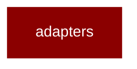

# adapters

<Badge color="purple">Wrapper</Badge>

## Overview



PraisonAI Adapters - Implementations for core protocols.

This module provides concrete implementations of:
- Reader adapters (AutoReader, LlamaIndexReaderAdapter, MarkItDownReaderAdapter)
- Vector store adapters (ChromaAdapter, PineconeAdapter, etc.)
- Retriever implementations
- Reranker implementations

## Import

```python
from praisonai import adapters
```
