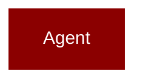

# agents_generator

<Badge color="purple">Wrapper</Badge>

## Overview



## Import

```python
from praisonai import agents_generator
```

## Classes

<AccordionGroup>
### AgentsGenerator

<Expandable title="Constructor Parameters">

<ParamField query="agent_file" type="Any">
   (Required)
</ParamField>
<ParamField query="framework" type="Any">
   (Required)
</ParamField>
<ParamField query="config_list" type="Any">
   (Required)
</ParamField>
<ParamField query="log_level" type="Any">
   (default: `None`)
</ParamField>
<ParamField query="agent_callback" type="Any">
   (default: `None`)
</ParamField>
<ParamField query="task_callback" type="Any">
   (default: `None`)
</ParamField>
<ParamField query="agent_yaml" type="Any">
   (default: `None`)
</ParamField>
<ParamField query="tools" type="Any">
   (default: `None`)
</ParamField>

</Expandable>

<AccordionGroup>
<Accordion title="is_function_or_decorated(obj: Any) -> Any">
  Checks if the given object is a function or has a __call__ method.

Parameters:
    obj (object): The object to be checked.

Returns:
    bool: True if the object is a function or has a __call__ method, False otherwise.
</Accordion>
<Accordion title="load_tools_from_module(module_path: Any) -> Any">
  Loads tools from a specified module path.

Parameters:
    module_path (str): The path to the module containing the tools.

Returns:
    dict: A dictionary containing the names of the tools as keys and the corresponding functions or objects as values.

Raises:
    FileNotFoundError: If the specified module path does not exist.
</Accordion>
<Accordion title="load_tools_from_module_class(module_path: Any) -> Any">
  Loads tools from a specified module path containing classes that inherit from BaseTool 
or are part of langchain_community.tools package.
</Accordion>
<Accordion title="load_tools_from_package(package_path: Any) -> Any">
  Loads tools from a specified package path containing modules with functions or classes.

Parameters:
    package_path (str): The path to the package containing the tools.

Returns:
    dict: A dictionary containing the names of the tools as keys and the corresponding initialized instances of the classes as values.

Raises:
    FileNotFoundError: If the specified package path does not exist.

This function iterates through all the .py files in the specified package path, excluding those that start with "__". For each file, it imports the corresponding module and checks if it contains any functions or classes that can be loaded as tools. The function then returns a dictionary containing the names of the tools as keys and the corresponding initialized instances of the classes as values.
</Accordion>
<Accordion title="load_tools_from_tools_py() -> Any">
  Imports and returns all contents from tools.py file.
Also adds the tools to the global namespace.

Returns:
    list: A list of callable functions with proper formatting
</Accordion>
<Accordion title="generate_crew_and_kickoff() -> Any">
  Generates a crew of agents and initiates tasks based on the provided configuration.

Parameters:
    agent_file (str): The path to the agent file.
    framework (str): The framework to be used for the agents.
    config_list (list): A list of configurations for the agents.

Returns:
    str: The output of the tasks performed by the crew of agents.

Raises:
    FileNotFoundError: If the specified agent file does not exist.

This function first loads the agent configuration from the specified file. It then initializes the tools required for the agents based on the specified framework. If the specified framework is "autogen", it loads the LLM configuration dynamically and creates an AssistantAgent for each role in the configuration. It then adds tools to the agents if specified in the configuration. Finally, it prepares tasks for the agents based on the configuration and initiates the tasks using the crew of agents. If the specified framework is not "autogen", it creates a crew of agents and initiates tasks based on the configuration.
</Accordion>
</AccordionGroup>

</AccordionGroup>

## Functions

<AccordionGroup>
### safe_format()

Safely format a string template, preserving JSON-like curly braces.

This handles cases where templates contain Gutenberg block syntax like
&#123;"level":2&#125; which would cause KeyError with standard .format().

Uses a two-pass approach:
1. Escape all &#123;&#123; and &#125;&#125; (already escaped braces)
2. Only substitute known variable placeholders

Args:
    template: String template with &#123;variable&#125; placeholders
    **kwargs: Variable substitutions to apply
    
Returns:
    Formatted string with variables substituted and JSON preserved
    
Example:
    &gt;&gt;&gt; safe_format('Use &lt;!-- wp:heading &#123;"level":2&#125; --&gt; for &#123;topic&#125;', topic='AI')
    'Use &lt;!-- wp:heading &#123;"level":2&#125; --&gt; for AI'

```python
def safe_format(template: str) -> str
```

<Expandable title="Parameters">

<ParamField query="template" type="str">
</ParamField>

</Expandable>

### noop()

```python
def noop() -> Any
```

### sanitize_agent_name_for_autogen_v4()

Sanitize agent name to be a valid Python identifier for AutoGen v0.4.

Args:
    name (str): The original agent name
    
Returns:
    str: A valid Python identifier

```python
def sanitize_agent_name_for_autogen_v4(name: Any) -> Any
```

<Expandable title="Parameters">

<ParamField query="name" type="Any">
</ParamField>

</Expandable>

### disable_crewai_telemetry()

```python
def disable_crewai_telemetry() -> Any
```

</AccordionGroup>
