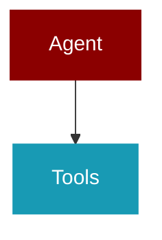

# auto

<Badge color="purple">Wrapper</Badge>

## Overview



Auto-generation module for PraisonAI agents and workflows.

This module uses FULL LAZY LOADING for all heavy dependencies:
- crewai: Only loaded when framework='crewai' is used
- autogen: Only loaded when framework='autogen' is used  
- praisonaiagents: Only loaded when framework='praisonai' is used
- litellm: Only loaded when structured output is needed
- openai: Fallback for structured output when litellm unavailable
- praisonai_tools: Only loaded when tools are needed

This ensures minimal import-time overhead.

## Import

```python
from praisonai import auto
```

## Classes

### BaseAutoGenerator

Base class for auto-generators with shared functionality.

Provides:
- LiteLLM-based structured output (replaces instructor for less dependencies)
- Environment variable handling for model/API configuration
- Config list management

<Expandable title="Constructor Parameters">

<ParamField query="config_list" type="Optional">
   (default: `None`)
</ParamField>

</Expandable>

#### Methods

##### get_available_tools() -> List

Return list of available tools for agent assignment.

---
##### analyze_complexity(topic: str) -> str

Analyze task complexity based on keywords.

Args:
    topic: The task description
    
Returns:
    str: Complexity level - 'simple', 'moderate', or 'complex'

---

### TaskDetails

*Extends: BaseModel*

Details for a single task.

<Expandable title="Properties">

<ResponseField name="description" type="str">
</ResponseField>
<ResponseField name="expected_output" type="str">
</ResponseField>

</Expandable>

### RoleDetails

*Extends: BaseModel*

Details for a single role/agent.

<Expandable title="Properties">

<ResponseField name="role" type="str">
</ResponseField>
<ResponseField name="goal" type="str">
</ResponseField>
<ResponseField name="backstory" type="str">
</ResponseField>
<ResponseField name="tasks" type="Dict">
</ResponseField>
<ResponseField name="tools" type="List">
</ResponseField>

</Expandable>

### TeamStructure

*Extends: BaseModel*

Structure for multi-agent team.

<Expandable title="Properties">

<ResponseField name="roles" type="Dict">
</ResponseField>

</Expandable>

### SingleAgentStructure

*Extends: BaseModel*

Structure for single-agent generation (Anthropic's 'start simple' principle).

<Expandable title="Properties">

<ResponseField name="name" type="str">
</ResponseField>
<ResponseField name="role" type="str">
</ResponseField>
<ResponseField name="goal" type="str">
</ResponseField>
<ResponseField name="backstory" type="str">
</ResponseField>
<ResponseField name="instructions" type="str">
</ResponseField>
<ResponseField name="tools" type="List">
</ResponseField>
<ResponseField name="task_description" type="str">
</ResponseField>
<ResponseField name="expected_output" type="str">
</ResponseField>

</Expandable>

### PatternRecommendation

*Extends: BaseModel*

LLM-based pattern recommendation with reasoning.

<Expandable title="Properties">

<ResponseField name="pattern" type="str">
</ResponseField>
<ResponseField name="reasoning" type="str">
</ResponseField>
<ResponseField name="confidence" type="float">
</ResponseField>

</Expandable>

### ValidationGate

*Extends: BaseModel*

Validation gate for prompt chaining workflows.

<Expandable title="Properties">

<ResponseField name="criteria" type="str">
</ResponseField>
<ResponseField name="pass_action" type="str">
</ResponseField>
<ResponseField name="fail_action" type="str">
</ResponseField>

</Expandable>

### AutoGenerator

*Extends: BaseAutoGenerator*

Auto-generates agents.yaml files from a topic description.

Inherits from BaseAutoGenerator for shared LLM client functionality.

Usage:
    generator = AutoGenerator(framework="crewai", topic="Create a movie script")
    path = generator.generate()

<Expandable title="Constructor Parameters">

<ParamField query="topic" type="Any">
   (default: `'Movie Story writing about AI'`)
</ParamField>
<ParamField query="agent_file" type="Any">
   (default: `'test.yaml'`)
</ParamField>
<ParamField query="framework" type="Any">
   (default: `'crewai'`)
</ParamField>
<ParamField query="config_list" type="Optional">
   (default: `None`)
</ParamField>
<ParamField query="pattern" type="str">
   (default: `'sequential'`)
</ParamField>
<ParamField query="single_agent" type="bool">
   (default: `False`)
</ParamField>

</Expandable>

#### Methods

##### recommend_pattern(topic: str) -> str

Recommend the best workflow pattern based on task characteristics.

Args:
    topic: The task description (uses self.topic if not provided)
    
Returns:
    str: Recommended pattern name

---
##### generate(merge: Any) -> Any

Generates a team structure for the specified topic.

Args:
    merge (bool): Whether to merge with existing agents.yaml file instead of overwriting.

Returns:
    str: The full path of the YAML file containing the generated team structure.

Raises:
    Exception: If the generation process fails.

Usage:
    generator = AutoGenerator(framework="crewai", topic="Create a movie script about Cat in Mars")
    path = generator.generate()
    print(path)

---
##### convert_and_save(json_data: Any, merge: Any) -> Any

Converts the provided JSON data into the desired YAML format and saves it to a file.

Args:
    json_data (dict): The JSON data representing the team structure.
    merge (bool): Whether to merge with existing agents.yaml file instead of overwriting.

---
##### merge_with_existing_agents(new_json_data: Any) -> Any

Merge existing agents.yaml with new auto-generated agents.

Args:
    new_json_data (dict): The JSON data representing the new team structure.
    
Returns:
    dict: The merged YAML data structure.

---
##### discover_tools_for_topic() -> List

Discover appropriate tools for the topic using intelligent matching.

Returns:
    List of tool names appropriate for this topic

---
##### get_user_content() -> Any

Generates a prompt for the OpenAI API to generate a team structure.
Uses intelligent tool discovery based on task analysis.

Args:
    None

Returns:
    str: The prompt for the OpenAI API.

Usage:
    generator = AutoGenerator(framework="crewai", topic="Create a movie script about Cat in Mars")
    prompt = generator.get_user_content()
    print(prompt)

---

### WorkflowStepDetails

*Extends: BaseModel*

Details for a workflow step.

<Expandable title="Properties">

<ResponseField name="agent" type="str">
</ResponseField>
<ResponseField name="action" type="str">
</ResponseField>
<ResponseField name="expected_output" type="Optional">
</ResponseField>

</Expandable>

### WorkflowRouteDetails

*Extends: BaseModel*

Details for a route step.

<Expandable title="Properties">

<ResponseField name="name" type="str">
</ResponseField>
<ResponseField name="route" type="Dict">
</ResponseField>

</Expandable>

### WorkflowParallelDetails

*Extends: BaseModel*

Details for a parallel step.

<Expandable title="Properties">

<ResponseField name="name" type="str">
</ResponseField>
<ResponseField name="parallel" type="List">
</ResponseField>

</Expandable>

### WorkflowAgentDetails

*Extends: BaseModel*

Details for a workflow agent.

<Expandable title="Properties">

<ResponseField name="name" type="str">
</ResponseField>
<ResponseField name="role" type="str">
</ResponseField>
<ResponseField name="goal" type="str">
</ResponseField>
<ResponseField name="instructions" type="str">
</ResponseField>
<ResponseField name="tools" type="Optional">
</ResponseField>

</Expandable>

### WorkflowStructure

*Extends: BaseModel*

Structure for auto-generated workflow.

<Expandable title="Properties">

<ResponseField name="name" type="str">
</ResponseField>
<ResponseField name="description" type="str">
</ResponseField>
<ResponseField name="agents" type="Dict">
</ResponseField>
<ResponseField name="steps" type="List">
</ResponseField>
<ResponseField name="gates" type="Optional">
</ResponseField>

</Expandable>

### WorkflowAutoGenerator

*Extends: BaseAutoGenerator*

Auto-generates workflow.yaml files from a topic description.

Inherits from BaseAutoGenerator for shared LLM client functionality.

Usage:
    generator = WorkflowAutoGenerator(topic="Research AI trends and write a report")
    path = generator.generate()

<Expandable title="Constructor Parameters">

<ParamField query="topic" type="str">
   (default: `'Research and write about AI'`)
</ParamField>
<ParamField query="workflow_file" type="str">
   (default: `'workflow.yaml'`)
</ParamField>
<ParamField query="config_list" type="Optional">
   (default: `None`)
</ParamField>
<ParamField query="framework" type="str">
   (default: `'praisonai'`)
</ParamField>
<ParamField query="single_agent" type="bool">
   (default: `False`)
</ParamField>

</Expandable>

#### Methods

##### recommend_pattern(topic: str) -> str

Recommend the best workflow pattern based on task characteristics.

Args:
    topic: The task description (uses self.topic if not provided)
    
Returns:
    str: Recommended pattern name
    
Pattern recommendations based on Anthropic's best practices:
- sequential: Clear step-by-step dependencies
- parallel: Independent subtasks that can run concurrently
- routing: Different input types need different handling
- orchestrator-workers: Complex tasks needing dynamic decomposition
- evaluator-optimizer: Tasks requiring iterative refinement

---
##### recommend_pattern_llm(topic: str) -> PatternRecommendation

Use LLM to recommend the best workflow pattern with reasoning.

Args:
    topic: The task description (uses self.topic if not provided)
    
Returns:
    PatternRecommendation: Pattern with reasoning and confidence score

---
##### generate(pattern: str, merge: bool) -> str

Generate a workflow YAML file.

Args:
    pattern: Workflow pattern - "sequential", "routing", "parallel", "loop",
             "orchestrator-workers", "evaluator-optimizer"
    merge: If True, merge with existing workflow file instead of overwriting
    
Returns:
    Path to the generated workflow file

---
##### merge_with_existing_workflow(new_data: Dict) -> Dict

Merge new workflow data with existing workflow file.

Args:
    new_data: The new workflow data to merge
    
Returns:
    Dict: Merged workflow data

---


## Functions

### get_all_available_tools()

Get all available tools organized by category.

Returns:
    Dict mapping category names to lists of tool names

```python
def get_all_available_tools() -> Dict
```

### get_tools_for_task()

Analyze a task description and return appropriate tools.

Args:
    task_description: The task to analyze
    
Returns:
    List of tool names appropriate for the task

```python
def get_tools_for_task(task_description: str) -> List
```

<Expandable title="Parameters">

<ParamField query="task_description" type="str">
</ParamField>

</Expandable>

### recommend_agent_count()

Recommend the optimal number of agents based on task complexity.

Args:
    task_description: The task to analyze
    
Returns:
    Recommended number of agents (1-4)

```python
def recommend_agent_count(task_description: str) -> int
```

<Expandable title="Parameters">

<ParamField query="task_description" type="str">
</ParamField>

</Expandable>

