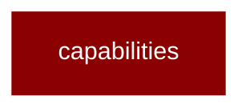

# capabilities

<Badge color="purple">Wrapper</Badge>

## Overview



PraisonAI Capabilities Module

This module provides LiteLLM endpoint capability parity for PraisonAI.
All capabilities are lazy-loaded to minimize import overhead.

Capabilities:
- audio: Transcription and text-to-speech
- images: Image generation and editing
- videos: Video generation
- files: File upload and management
- batches: Batch processing
- vector_stores: Vector store management
- embeddings: Text embeddings
- rerank: Document reranking
- moderations: Content moderation
- ocr: Optical character recognition
- assistants: OpenAI-style assistants
- fine_tuning: Model fine-tuning
- responses: Response management
- passthrough: Generic API passthrough
- containers: Container management
- search: Search capabilities
- a2a: Agent-to-agent gateway

## Import

```python
from praisonai import capabilities
```
