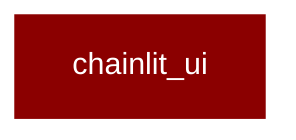

# chainlit_ui

<Badge color="purple">Wrapper</Badge>

## Overview



## Import

```python
from praisonai import chainlit_ui
```

## Functions

<AccordionGroup>
### on_run()

```python
async def on_run(action: Any) -> Any
```

<Expandable title="Parameters">

<ParamField query="action" type="Any">
</ParamField>

</Expandable>

### on_modify()

```python
async def on_modify(action: Any) -> Any
```

<Expandable title="Parameters">

<ParamField query="action" type="Any">
</ParamField>

</Expandable>

### set_profiles()

```python
async def set_profiles(current_user: cl.User) -> Any
```

<Expandable title="Parameters">

<ParamField query="current_user" type="cl.User">
</ParamField>

</Expandable>

### start_chat()

```python
async def start_chat() -> Any
```

### on_settings_update()

Handle updates to the ChatSettings form.

```python
async def on_settings_update(settings: Any) -> Any
```

<Expandable title="Parameters">

<ParamField query="settings" type="Any">
</ParamField>

</Expandable>

### on_chat_resume()

```python
async def on_chat_resume(thread: ThreadDict) -> Any
```

<Expandable title="Parameters">

<ParamField query="thread" type="ThreadDict">
</ParamField>

</Expandable>

### run_agents()

Runs the agents and returns the result.

```python
async def run_agents(agent_file: str, framework: str) -> Any
```

<Expandable title="Parameters">

<ParamField query="agent_file" type="str">
</ParamField>
<ParamField query="framework" type="str">
</ParamField>

</Expandable>

### output()

```python
async def output(output: Any) -> Any
```

<Expandable title="Parameters">

<ParamField query="output" type="Any">
</ParamField>

</Expandable>

### agent()

```python
def agent(output: Any) -> Any
```

<Expandable title="Parameters">

<ParamField query="output" type="Any">
</ParamField>

</Expandable>

### task()

```python
def task(output: Any) -> Any
```

<Expandable title="Parameters">

<ParamField query="output" type="Any">
</ParamField>

</Expandable>

### main()

Run PraisonAI with the provided message as the topic.

```python
async def main(message: cl.Message) -> Any
```

<Expandable title="Parameters">

<ParamField query="message" type="cl.Message">
</ParamField>

</Expandable>

### auth_callback()

```python
def auth_callback(username: str, password: str) -> Any
```

<Expandable title="Parameters">

<ParamField query="username" type="str">
</ParamField>
<ParamField query="password" type="str">
</ParamField>

</Expandable>

</AccordionGroup>
