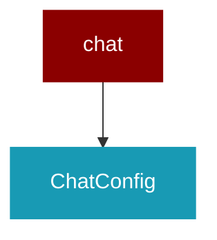

# chat

<Badge color="purple">Wrapper</Badge>

## Overview



PraisonAI Chat Module

This module provides the chat UI integration for PraisonAI agents.
It uses the PraisonAI Chat (based on Chainlit) for the frontend.

## Import

```python
from praisonai import chat
```

## Classes

<AccordionGroup>
### ChatConfig

Configuration for the PraisonAI Chat server.

<Expandable title="Constructor Parameters">

<ParamField query="host" type="str">
   (default: `'0.0.0.0'`)
</ParamField>
<ParamField query="port" type="int">
   (default: `8000`)
</ParamField>
<ParamField query="debug" type="bool">
   (default: `False`)
</ParamField>
<ParamField query="auth_enabled" type="bool">
   (default: `False`)
</ParamField>
<ParamField query="session_id" type="Optional">
   (default: `None`)
</ParamField>

</Expandable>

</AccordionGroup>

## Functions

<AccordionGroup>
### start_chat_server()

Start the PraisonAI Chat server.

Args:
    agent: A single PraisonAI agent to use in the chat.
    agents: A list of PraisonAI agents for multi-agent chat.
    config: ChatConfig object with server settings.
    port: Port to run the server on (default: 8000).
    host: Host to bind to (default: 0.0.0.0).
    debug: Enable debug mode (default: False).

Example:
    &gt;&gt;&gt; from praisonaiagents import Agent
    &gt;&gt;&gt; from praisonai.chat import start_chat_server
    &gt;&gt;&gt; 
    &gt;&gt;&gt; agent = Agent(name="Assistant", instructions="You are helpful.")
    &gt;&gt;&gt; start_chat_server(agent=agent, port=8000)

```python
def start_chat_server(agent: Optional) -> None
```

<Expandable title="Parameters">

<ParamField query="agent" type="Optional">
</ParamField>
<ParamField query="agents" type="Optional">
</ParamField>
<ParamField query="config" type="Optional">
</ParamField>
<ParamField query="port" type="int">
</ParamField>
<ParamField query="host" type="str">
</ParamField>
<ParamField query="debug" type="bool">
</ParamField>

</Expandable>

### get_registered_agents()

Get all registered agents.

```python
def get_registered_agents() -> dict
```

</AccordionGroup>
