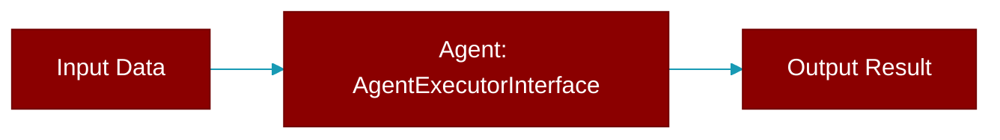

# AgentExecutorInterface

> Defined in the [**Agent Scheduler**](../modules/agent_scheduler) module.

<Badge color="purple">AI Agents Framework</Badge>

Abstract interface for agent execution.

## Methods

<CardGroup cols={2}>
  <Card title="execute()" icon="function" href="../functions/AgentExecutorInterface-execute">
    Execute the agent with given task.
  </Card>
</CardGroup>
