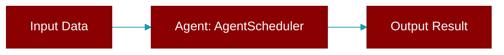

# AgentScheduler

> Defined in the [**Agent Scheduler**](../modules/agent_scheduler) module.

<Badge color="purple">AI Agents Framework</Badge>

Scheduler for running PraisonAI agents periodically.

Features:
- Interval-based scheduling (hourly, daily, custom)
- Thread-safe operation
- Automatic retry on failure
- Execution logging and monitoring
- Graceful shutdown



## Constructor

<ParamField query="agent" type="Any" required={true}>
  The PraisonAI agent or `AsyncPraisonAgentExecutor` instance to run.
</ParamField>

<ParamField query="task" type="str" required={true}>
  The prompt / task string passed to the agent on each run.
</ParamField>

<ParamField query="config" type="Optional[Dict[str, Any]]" required={false}>
  Optional extra config (reserved; currently unused).
</ParamField>

<ParamField query="on_success" type="Optional[Callable[[Any], None]]" required={false}>
  Invoked with the agent's result after a successful run. Sync or async; exceptions are logged, not raised.
</ParamField>

<ParamField query="on_failure" type="Optional[Callable[[Exception], None]]" required={false}>
  Invoked with the last captured exception after `max_retries` attempts fail. Sync or async; exceptions are logged, not raised.
</ParamField>

## Methods

<CardGroup cols={2}>
  <Card title="start()" icon="function" href="../functions/AgentScheduler-start">
    Start scheduled agent execution.
  </Card>
  <Card title="stop()" icon="function" href="../functions/AgentScheduler-stop">
    Stop the scheduler gracefully.
  </Card>
  <Card title="get_stats()" icon="function" href="../functions/AgentScheduler-get_stats">
    Get execution statistics.
  </Card>
  <Card title="execute_once()" icon="function" href="../functions/AgentScheduler-execute_once">
    Execute agent immediately (one-time execution).
  </Card>
</CardGroup>

## Usage

```python
scheduler = AgentScheduler(agent, task="Check news")
    scheduler.start(schedule_expr="hourly", max_retries=3)
    # Agent runs every hour automatically
    scheduler.stop()  # Stop when needed
```


## Source

<Card title="View on GitHub" icon="github" href="https://github.com/MervinPraison/PraisonAI/blob/main/src/praisonai/praisonai/agent_scheduler.py#L119">
  `praisonai/agent_scheduler.py` at line 119
</Card>


---

## Related Documentation

<CardGroup cols={2}>
  <Card title="Agents Concept" icon="robot" href="/docs/concepts/agents" />
  <Card title="Single Agent Guide" icon="book-open" href="/docs/guides/single-agent" />
  <Card title="Multi-Agent Guide" icon="users" href="/docs/guides/multi-agent" />
  <Card title="Agent Configuration" icon="gear" href="/docs/configuration/agent-config" />
  <Card title="Auto Agents" icon="wand-magic-sparkles" href="/docs/features/autoagents" />
</CardGroup>
