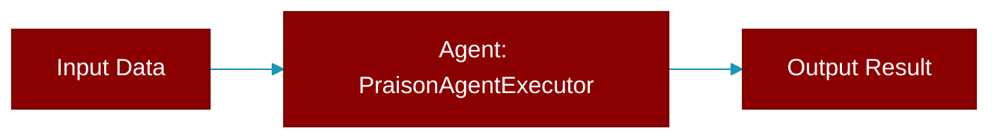

# PraisonAgentExecutor

> Defined in the [**Agent Scheduler**](../modules/agent_scheduler) module.

<Badge color="purple">AI Agents Framework</Badge>

Executor for PraisonAI agents.

## Constructor

<ParamField query="agent" type="Any" required={true}>
  No description available.
</ParamField>

## Methods

<CardGroup cols={2}>
  <Card title="execute()" icon="function" href="../functions/PraisonAgentExecutor-execute">
    Execute the agent with given task.
  </Card>
</CardGroup>

## Source

<Card title="View on GitHub" icon="github" href="https://github.com/MervinPraison/PraisonAI/blob/main/src/praisonai/praisonai/agent_scheduler.py#L89">
  `praisonai/agent_scheduler.py` at line 89
</Card>

---

## Related Documentation

<CardGroup cols={2}>
  <Card title="Agents Concept" icon="robot" href="/docs/concepts/agents" />
  <Card title="Single Agent Guide" icon="book-open" href="/docs/guides/single-agent" />
  <Card title="Multi-Agent Guide" icon="users" href="/docs/guides/multi-agent" />
  <Card title="Agent Configuration" icon="gear" href="/docs/configuration/agent-config" />
  <Card title="Auto Agents" icon="wand-magic-sparkles" href="/docs/features/autoagents" />
</CardGroup>
