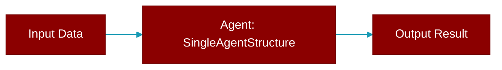

# SingleAgentStructure

> Defined in the [**auto**](../modules/auto) module.

Structure for single-agent generation (Anthropic's 'start simple' principle).

## Properties

<ResponseField name="name" type="str">
  No description available.
</ResponseField>

<ResponseField name="role" type="str">
  No description available.
</ResponseField>

<ResponseField name="goal" type="str">
  No description available.
</ResponseField>

<ResponseField name="backstory" type="str">
  No description available.
</ResponseField>

<ResponseField name="instructions" type="str">
  No description available.
</ResponseField>

<ResponseField name="tools" type="List">
  No description available.
</ResponseField>

<ResponseField name="task_description" type="str">
  No description available.
</ResponseField>

<ResponseField name="expected_output" type="str">
  No description available.
</ResponseField>
