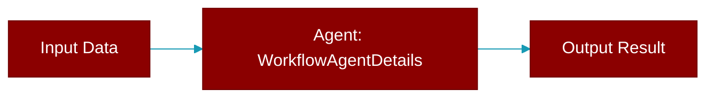

# WorkflowAgentDetails

> Defined in the [**auto**](../modules/auto) module.

<Badge color="purple">AI Agents Framework</Badge>

Details for a workflow agent.

## Properties

<ResponseField name="name" type="str">
  No description available.
</ResponseField>

<ResponseField name="role" type="str">
  No description available.
</ResponseField>

<ResponseField name="goal" type="str">
  No description available.
</ResponseField>

<ResponseField name="instructions" type="str">
  No description available.
</ResponseField>

<ResponseField name="tools" type="Optional">
  No description available.
</ResponseField>

---

## Related Documentation

<CardGroup cols={2}>
  <Card title="Agents Concept" icon="robot" href="/docs/concepts/agents" />
  <Card title="Single Agent Guide" icon="book-open" href="/docs/guides/single-agent" />
  <Card title="Multi-Agent Guide" icon="users" href="/docs/guides/multi-agent" />
  <Card title="Agent Configuration" icon="gear" href="/docs/configuration/agent-config" />
  <Card title="Auto Agents" icon="wand-magic-sparkles" href="/docs/features/autoagents" />
</CardGroup>
