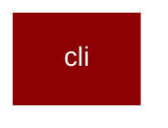

# cli

<Badge color="purple">Wrapper</Badge>

## Overview



PraisonAI CLI Package

This package provides the command-line interface for PraisonAI.

Structure:
- main.py: Main CLI entry point (PraisonAI class)
- features/: Feature handlers for CLI flags and commands

## Import

```python
from praisonai import cli
```

## Functions

<AccordionGroup>
### main()

CLI entry point function.

```python
def main() -> Any
```

</AccordionGroup>
