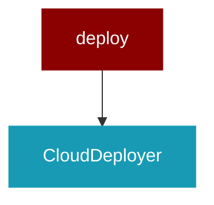

# deploy

<Badge color="purple">Wrapper</Badge>

## Overview



## Import

```python
from praisonai import deploy
```

## Classes

### CloudDeployer

A class for deploying a cloud-based application.

Attributes:
    None

Methods:
    __init__(self):
        Loads environment variables from .env file or system and sets them.

#### Methods

##### create_dockerfile() -> Any

Creates a Dockerfile for the application.

Parameters:
    self: An instance of the CloudDeployer class.

Returns:
    None

Raises:
    None

This method creates a Dockerfile in the current directory with the specified content.
The Dockerfile is used to build a Docker image for the application.
The content of the Dockerfile includes instructions to use the Python 3.11-slim base image,
set the working directory to /app, copy the current directory contents into the container,
install the required Python packages (flask, praisonai, gunicorn, and markdown),
expose port 8080, and run the application using Gunicorn.

---
##### create_api_file() -> Any

Creates an API file for the application.

Parameters:
    self (CloudDeployer): An instance of the CloudDeployer class.

Returns:
    None

This method creates an API file named "api.py" in the current directory. The file contains a basic Flask application that uses the PraisonAI library to run a simple agent and returns the output as an HTML page. The application listens on the root path ("/") and uses the Markdown library to format the output.

---
##### set_environment_variables() -> Any

Sets environment variables with fallback to .env values or defaults.

---
##### run_commands() -> Any

Sets environment variables with fallback to .env values or defaults.

Parameters:
    None

Returns:
    None

Raises:
    None

This method sets environment variables for the application. It uses the `os.environ` dictionary to set the following environment variables:

- `OPENAI_MODEL_NAME`: The name of the OpenAI model to use. If not specified in the .env file, it defaults to "gpt-4o-mini".
- `OPENAI_API_KEY`: The API key for accessing the OpenAI API. If not specified in the .env file, it defaults to "Enter your API key".
- `OPENAI_API_BASE`: The base URL for the OpenAI API. If not specified in the .env file, it defaults to "https://api.openai.com/v1".

---

