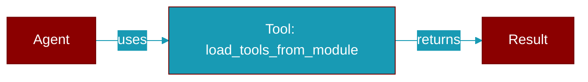

# load_tools_from_module

<div className="flex items-center gap-2">
  <Badge color="purple">Method</Badge>
</div>

> This is a method of the [**AgentsGenerator**](../classes/AgentsGenerator) class in the [**agents_generator**](../modules/agents_generator) module.

Loads tools from a specified module path.



## Signature

```python
def load_tools_from_module(module_path: Any) -> Any
```

## Parameters

<ParamField query="module_path" type="Any" required={true}>
  The path to the module containing the tools.
</ParamField>

### Returns

<ResponseField name="Returns" type="Any">
  A dictionary containing the names of the tools as keys and the corresponding functions or objects as values.
</ResponseField>

### Exceptions

<AccordionGroup>
  <Accordion title="FileNotFoundError">
    If the specified module path does not exist.
  </Accordion>
</AccordionGroup>
