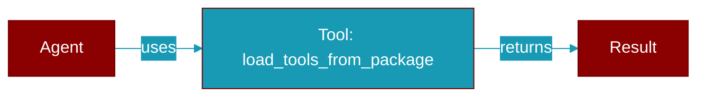

# load_tools_from_package

<div className="flex items-center gap-2">
  <Badge color="purple">Method</Badge>
</div>

> This is a method of the [**AgentsGenerator**](../classes/AgentsGenerator) class in the [**agents_generator**](../modules/agents_generator) module.

Loads tools from a specified package path containing modules with functions or classes.



## Signature

```python
def load_tools_from_package(package_path: Any) -> Any
```

## Parameters

<ParamField query="package_path" type="Any" required={true}>
  The path to the package containing the tools.
</ParamField>

### Returns

<ResponseField name="Returns" type="Any">
  A dictionary containing the names of the tools as keys and the corresponding initialized instances of the classes as values.
</ResponseField>

### Exceptions

<AccordionGroup>
  <Accordion title="FileNotFoundError">
    If the specified package path does not exist.
  </Accordion>
</AccordionGroup>


---

## Related Documentation

<CardGroup cols={2}>
  <Card title="Tools Concept" icon="wrench" href="/docs/concepts/tools" />
  <Card title="Create Custom Tools" icon="plus" href="/docs/guides/tools/create-custom-tools" />
  <Card title="Tool Development" icon="code" href="/docs/tutorials/advanced-tool-development" />
</CardGroup>
