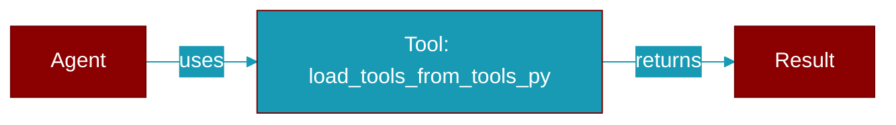

# load_tools_from_tools_py

<div className="flex items-center gap-2">
  <Badge color="purple">Method</Badge>
</div>

> This is a method of the [**AgentsGenerator**](../classes/AgentsGenerator) class in the [**agents_generator**](../modules/agents_generator) module.

Imports and returns all contents from tools.py file.
Also adds the tools to the global namespace.



## Signature

```python
def load_tools_from_tools_py() -> Any
```

### Returns

<ResponseField name="Returns" type="Any">
  A list of callable functions with proper formatting
</ResponseField>


---

## Related Documentation

<CardGroup cols={2}>
  <Card title="Tools Concept" icon="wrench" href="/docs/concepts/tools" />
  <Card title="Create Custom Tools" icon="plus" href="/docs/guides/tools/create-custom-tools" />
  <Card title="Tool Development" icon="code" href="/docs/tutorials/advanced-tool-development" />
</CardGroup>
