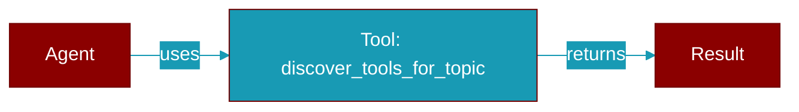

# discover_tools_for_topic

<div className="flex items-center gap-2">
  <Badge color="purple">Method</Badge>
</div>

> This is a method of the [**AutoGenerator**](../classes/AutoGenerator) class in the [**auto**](../modules/auto) module.

Discover appropriate tools for the topic using intelligent matching.



## Signature

```python
def discover_tools_for_topic() -> List[str]
```

### Returns

<ResponseField name="Returns" type="List[str]">
  List of tool names appropriate for this topic
</ResponseField>
