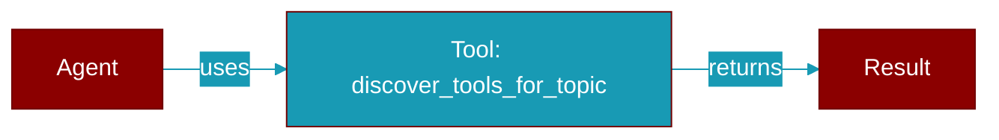

# discover_tools_for_topic

<div className="flex items-center gap-2">
  <Badge color="purple">Method</Badge>
</div>

> This is a method of the [**AutoGenerator**](../classes/AutoGenerator) class in the [**auto**](../modules/auto) module.

Discover appropriate tools for the topic using intelligent matching.



## Signature

```python
def discover_tools_for_topic() -> List[str]
```

### Returns

<ResponseField name="Returns" type="List[str]">
  List of tool names appropriate for this topic
</ResponseField>


---

## Related Documentation

<CardGroup cols={2}>
  <Card title="Tools Concept" icon="wrench" href="/docs/concepts/tools" />
  <Card title="Create Custom Tools" icon="plus" href="/docs/guides/tools/create-custom-tools" />
  <Card title="Tool Development" icon="code" href="/docs/tutorials/advanced-tool-development" />
</CardGroup>
