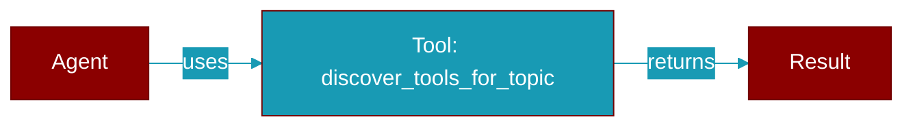

# discover_tools_for_topic

<div className="flex items-center gap-2">
  <Badge color="purple">Method</Badge>
</div>

> This is a method of the [**AutoGenerator**](../classes/AutoGenerator) class in the [**auto**](../modules/auto) module.

Discover appropriate tools for the topic.

Drives recommendations through the canonical ToolResolver (single source
of truth) so only tools that are actually installed are surfaced. Keyword
hints are used to prioritise, but the returned set is intersected with the
real registry when it is available, avoiding recommendations for tools the
user does not have. Falls back to keyword hints when the resolver cannot
be constructed.


```mermaid
%%{init: {'theme': 'base', 'themeVariables': { 'primaryColor': '#8B0000', 'primaryTextColor': '#fff', 'primaryBorderColor': '#710101', 'lineColor': '#189AB4', 'secondaryColor': '#189AB4', 'tertiaryColor': '#fff' }}}%%

graph LR
    agent["Agent"] -- "uses" --> tool["Tool: discover_tools_for_topic"]
    tool -- "returns" --> result["Result"]
    style tool fill:#189AB4,color:#fff
    style agent fill:#8B0000,color:#fff
    style result fill:#8B0000,color:#fff
```

## Signature

```python
def discover_tools_for_topic() -> List[str]
```

### Returns

<ResponseField name="Returns" type="List[str]">
  The result of the operation.
</ResponseField>


## Source

<Card title="View on GitHub" icon="github" href="https://github.com/MervinPraison/PraisonAI/blob/main/src/praisonai/praisonai/auto.py#L1219">
  `praisonai/auto.py` at line 1219
</Card>


---

## Related Documentation

<CardGroup cols={2}>
  <Card title="Tools Concept" icon="wrench" href="/docs/concepts/tools" />
  <Card title="Create Custom Tools" icon="plus" href="/docs/guides/tools/create-custom-tools" />
  <Card title="Tool Development" icon="code" href="/docs/tutorials/advanced-tool-development" />
</CardGroup>
