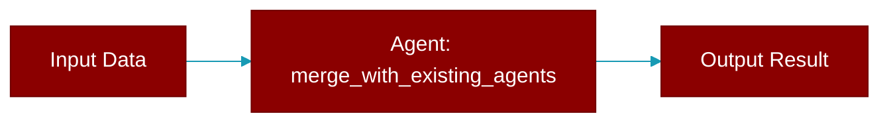

# merge_with_existing_agents

<div className="flex items-center gap-2">
  <Badge color="purple">Method</Badge>
</div>

> This is a method of the [**AutoGenerator**](../classes/AutoGenerator) class in the [**auto**](../modules/auto) module.

Merge existing agents.yaml with new auto-generated agents.



## Signature

```python
def merge_with_existing_agents(new_json_data: Any) -> Any
```

## Parameters

<ParamField query="new_json_data" type="Any" required={true}>
  The JSON data representing the new team structure.
</ParamField>

### Returns

<ResponseField name="Returns" type="Any">
  The merged YAML data structure.
</ResponseField>


## Source

<Card title="View on GitHub" icon="github" href="https://github.com/MervinPraison/PraisonAI/blob/main/src/praisonai/praisonai/auto.py#L782">
  `praisonai/auto.py` at line 782
</Card>


---

## Related Documentation

<CardGroup cols={2}>
  <Card title="Agents Concept" icon="robot" href="/docs/concepts/agents" />
  <Card title="Single Agent Guide" icon="book-open" href="/docs/guides/single-agent" />
  <Card title="Multi-Agent Guide" icon="users" href="/docs/guides/multi-agent" />
  <Card title="Agent Configuration" icon="gear" href="/docs/configuration/agent-config" />
  <Card title="Auto Agents" icon="wand-magic-sparkles" href="/docs/features/autoagents" />
</CardGroup>
