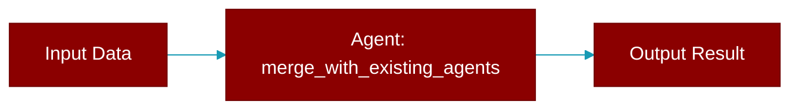

<div className="flex items-center gap-2">
  <Badge color="purple">Method</Badge>
</div>

> This is a method of the [**AutoGenerator**](../classes/AutoGenerator) class in the [**auto**](../modules/auto) module.

Merge existing agents.yaml with new auto-generated agents.



## Signature

```python
def merge_with_existing_agents(new_json_data: Any) -> Any
```

## Parameters

<ParamField query="new_json_data" type="Any" required={true}>
  The JSON data representing the new team structure.
</ParamField>

### Returns

<ResponseField name="Returns" type="Any">
  The merged YAML data structure.
</ResponseField>
