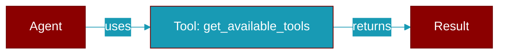

<div className="flex items-center gap-2">
  <Badge color="purple">Method</Badge>
</div>

> This is a method of the [**BaseAutoGenerator**](../classes/BaseAutoGenerator) class in the [**auto**](../modules/auto) module.

Return list of available tools for agent assignment.



## Signature

```python
def get_available_tools() -> List[str]
```

### Returns

<ResponseField name="Returns" type="List[str]">
  The result of the operation.
</ResponseField>
