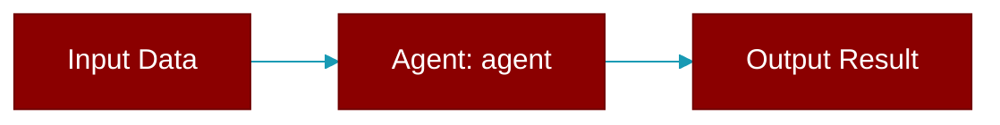

<div className="flex items-center gap-2">
  <Badge color="teal">Function</Badge>
</div>

> This function is defined in the [**chainlit_ui**](../modules/chainlit_ui) module.




## Signature

```python
def agent(output: Any) -> Any
```

## Parameters

<ParamField query="output" type="Any" required={true}>
  No description available.
</ParamField>

### Returns

<ResponseField name="Returns" type="Any">
  The result of the operation.
</ResponseField>
