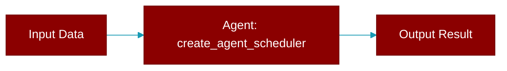

# create_agent_scheduler

<div className="flex items-center gap-2">
  <Badge color="teal">Function</Badge>
</div>

> This function is defined in the [**agent_scheduler**](../modules/agent_scheduler) module.

Factory function to create agent scheduler.



## Signature

```python
def create_agent_scheduler(agent: Any, task: str, config: Optional[Dict[str, Any]]) -> AgentScheduler
```

## Parameters

<ParamField query="agent" type="Any" required={true}>
  PraisonAI Agent instance
</ParamField>

<ParamField query="task" type="str" required={true}>
  Task description
</ParamField>

<ParamField query="config" type="Optional" required={false}>
  Optional configuration
</ParamField>

### Returns

<ResponseField name="Returns" type="AgentScheduler">
  Configured AgentScheduler instance
</ResponseField>


## Source

<Card title="View on GitHub" icon="github" href="https://github.com/MervinPraison/PraisonAI/blob/main/src/praisonai/praisonai/agent_scheduler.py#L321">
  `praisonai/agent_scheduler.py` at line 321
</Card>


---

## Related Documentation

<CardGroup cols={2}>
  <Card title="Agents Concept" icon="robot" href="/docs/concepts/agents" />
  <Card title="Single Agent Guide" icon="book-open" href="/docs/guides/single-agent" />
  <Card title="Multi-Agent Guide" icon="users" href="/docs/guides/multi-agent" />
  <Card title="Agent Configuration" icon="gear" href="/docs/configuration/agent-config" />
  <Card title="Auto Agents" icon="wand-magic-sparkles" href="/docs/features/autoagents" />
</CardGroup>
