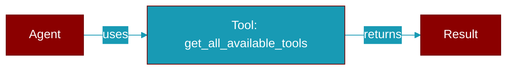

# get_all_available_tools

<div className="flex items-center gap-2">
  <Badge color="teal">Function</Badge>
</div>

> This function is defined in the [**auto**](../modules/auto) module.

Get all available tools organized by category.



## Signature

```python
def get_all_available_tools() -> Dict[str, List[str]]
```

### Returns

<ResponseField name="Returns" type="Dict[str, List[str]]">
  Dict mapping category names to lists of tool names
</ResponseField>


## Source

<Card title="View on GitHub" icon="github" href="https://github.com/MervinPraison/PraisonAI/blob/main/src/praisonai/praisonai/auto.py#L356">
  `praisonai/auto.py` at line 356
</Card>


---

## Related Documentation

<CardGroup cols={2}>
  <Card title="Tools Concept" icon="wrench" href="/docs/concepts/tools" />
  <Card title="Create Custom Tools" icon="plus" href="/docs/guides/tools/create-custom-tools" />
  <Card title="Tool Development" icon="code" href="/docs/tutorials/advanced-tool-development" />
</CardGroup>
