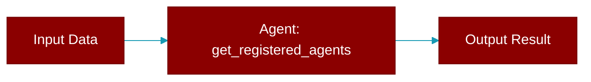

<div className="flex items-center gap-2">
  <Badge color="teal">Function</Badge>
</div>

> This function is defined in the [**chat**](../modules/chat) module.

Get all registered agents.



## Signature

```python
def get_registered_agents() -> dict
```

### Returns

<ResponseField name="Returns" type="dict">
  The result of the operation.
</ResponseField>
