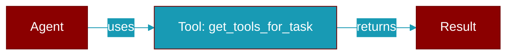

# get_tools_for_task

<div className="flex items-center gap-2">
  <Badge color="teal">Function</Badge>
</div>

> This function is defined in the [**auto**](../modules/auto) module.

Analyze a task description and return appropriate tools.



## Signature

```python
def get_tools_for_task(task_description: str) -> List[str]
```

## Parameters

<ParamField query="task_description" type="str" required={true}>
  The task to analyze
</ParamField>

### Returns

<ResponseField name="Returns" type="List[str]">
  List of tool names appropriate for the task
</ResponseField>
