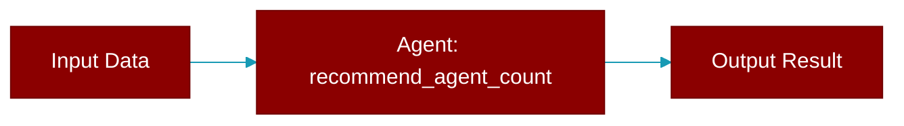

# recommend_agent_count

<div className="flex items-center gap-2">
  <Badge color="teal">Function</Badge>
</div>

> This function is defined in the [**auto**](../modules/auto) module.

Recommend the optimal number of agents based on task complexity.



## Signature

```python
def recommend_agent_count(task_description: str) -> int
```

## Parameters

<ParamField query="task_description" type="str" required={true}>
  The task to analyze
</ParamField>

### Returns

<ResponseField name="Returns" type="int">
  Recommended number of agents (1-4)
</ResponseField>
