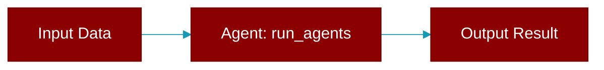

# run_agents

<div className="flex items-center gap-2">
  <Badge color="blue">Async</Badge>
  <Badge color="teal">Function</Badge>
</div>

> This function is defined in the [**chainlit_ui**](../modules/chainlit_ui) module.

Runs the agents and returns the result.



## Signature

```python
async def run_agents(agent_file: str, framework: str) -> Any
```

## Parameters

<ParamField query="agent_file" type="str" required={true}>
  No description available.
</ParamField>

<ParamField query="framework" type="str" required={true}>
  No description available.
</ParamField>

### Returns

<ResponseField name="Returns" type="Any">
  The result of the operation.
</ResponseField>


## Source

<Card title="View on GitHub" icon="github" href="https://github.com/MervinPraison/PraisonAI/blob/main/src/praisonai/praisonai/chainlit_ui.py#L186">
  `praisonai/chainlit_ui.py` at line 186
</Card>


---

## Related Documentation

<CardGroup cols={2}>
  <Card title="Agents Concept" icon="robot" href="/docs/concepts/agents" />
  <Card title="Single Agent Guide" icon="book-open" href="/docs/guides/single-agent" />
  <Card title="Multi-Agent Guide" icon="users" href="/docs/guides/multi-agent" />
  <Card title="Agent Configuration" icon="gear" href="/docs/configuration/agent-config" />
  <Card title="Auto Agents" icon="wand-magic-sparkles" href="/docs/features/autoagents" />
</CardGroup>
