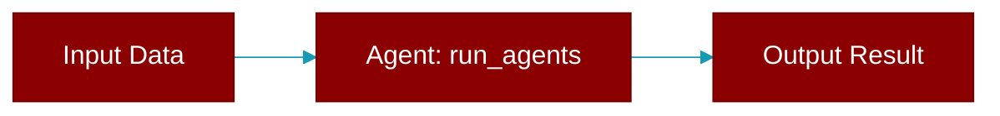

<div className="flex items-center gap-2">
  <Badge color="blue">Async</Badge>
  <Badge color="teal">Function</Badge>
</div>

> This function is defined in the [**chainlit_ui**](../modules/chainlit_ui) module.

Runs the agents and returns the result.



## Signature

```python
async def run_agents(agent_file: str, framework: str) -> Any
```

## Parameters

<ParamField query="agent_file" type="str" required={true}>
  No description available.
</ParamField>

<ParamField query="framework" type="str" required={true}>
  No description available.
</ParamField>

### Returns

<ResponseField name="Returns" type="Any">
  The result of the operation.
</ResponseField>
