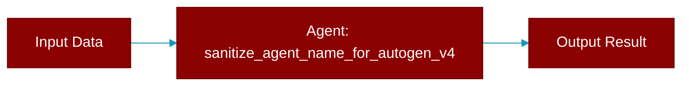

<div className="flex items-center gap-2">
  <Badge color="teal">Function</Badge>
</div>

> This function is defined in the [**agents_generator**](../modules/agents_generator) module.

Sanitize agent name to be a valid Python identifier for AutoGen v0.4.



## Signature

```python
def sanitize_agent_name_for_autogen_v4(name: Any) -> Any
```

## Parameters

<ParamField query="name" type="Any" required={true}>
  The original agent name
</ParamField>

### Returns

<ResponseField name="Returns" type="Any">
  A valid Python identifier
</ResponseField>
