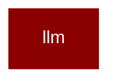

# llm

<Badge color="purple">Wrapper</Badge>

## Overview



LLM Module for PraisonAI CLI Wrapper.

This module provides LLM provider registry and utilities for the CLI wrapper.
The core LLM functionality is in praisonaiagents.llm.

## Import

```python
from praisonai import llm
```

## Functions

<AccordionGroup>
### embedding()

Get embedding vector for text.

.. deprecated::
    Use `from praisonai import embed` or `from praisonai.capabilities import embed` instead.
    This function returns raw vectors; the new embed() returns EmbeddingResult with metadata.

Args:
    text: Text string or list of strings to embed
    model: Embedding model name (default: text-embedding-3-small)
    **kwargs: Additional arguments passed to litellm.embedding()

Returns:
    List[float] for single text, or List[List[float]] for multiple texts

Example:
    from praisonai.llm import embedding
    
    # Single text
    emb = embedding("Hello world")
    
    # Multiple texts
    embs = embedding(["Hello", "World"])
    
    # Different model
    emb = embedding("Hello", model="text-embedding-3-large")

Note:
    Requires litellm. Install with: pip install praisonai[llm]

```python
def embedding(text: Any, model: Any) -> Any
```

<Expandable title="Parameters">

<ParamField query="text" type="Any">
</ParamField>
<ParamField query="model" type="Any">
</ParamField>

</Expandable>

</AccordionGroup>
