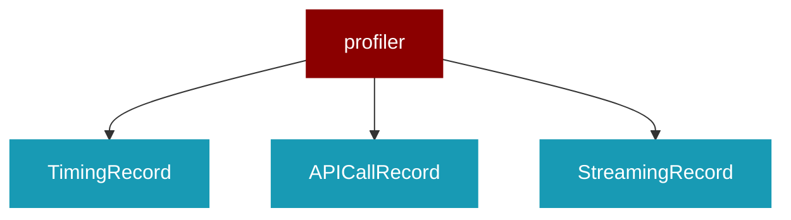

# profiler

<Badge color="purple">Wrapper</Badge>

## Overview



PraisonAI Profiler Module

Standardized profiling for performance monitoring across praisonai and praisonai-agents.

Features:
- Import timing
- Function execution timing
- Flow tracking
- File/module usage tracking
- Memory usage (tracemalloc)
- API call profiling (wall-clock time)
- Streaming profiling (TTFT, total time)
- Statistics (p50, p95, p99)
- cProfile integration
- Flamegraph generation
- Line-level profiling
- JSON/HTML export

Usage:
    from praisonai.profiler import Profiler, profile, profile_imports
    
    # Profile a function
    @profile
    def my_function():
        pass
    
    # Profile a block
    with Profiler.block("my_operation"):
        do_something()
    
    # Profile API calls
    with Profiler.api_call("https://api.example.com") as call:
        response = requests.get(...)
    
    # Profile streaming
    with Profiler.streaming("chat") as tracker:
        tracker.first_token()
        for chunk in stream:
            tracker.chunk()
    
    # Profile imports
    with profile_imports():
        import heavy_module
    
    # Get report with statistics
    Profiler.report()
    stats = Profiler.get_statistics()
    
    # Export
    Profiler.export_json()
    Profiler.export_html()

## Import

```python
from praisonai import profiler
```

## Classes

<AccordionGroup>
### TimingRecord

Record of a single timing measurement.

<Expandable title="Properties">

<ResponseField name="name" type="str">
</ResponseField>
<ResponseField name="duration_ms" type="float">
</ResponseField>
<ResponseField name="category" type="str">
</ResponseField>
<ResponseField name="file" type="str">
</ResponseField>
<ResponseField name="line" type="int">
</ResponseField>
<ResponseField name="timestamp" type="float">
</ResponseField>

</Expandable>

### APICallRecord

Record of an API/HTTP call.

<Expandable title="Properties">

<ResponseField name="endpoint" type="str">
</ResponseField>
<ResponseField name="method" type="str">
</ResponseField>
<ResponseField name="duration_ms" type="float">
</ResponseField>
<ResponseField name="status_code" type="int">
</ResponseField>
<ResponseField name="request_size" type="int">
</ResponseField>
<ResponseField name="response_size" type="int">
</ResponseField>
<ResponseField name="timestamp" type="float">
</ResponseField>

</Expandable>

### StreamingRecord

Record of streaming operation (LLM responses).

<Expandable title="Properties">

<ResponseField name="name" type="str">
</ResponseField>
<ResponseField name="ttft_ms" type="float">
</ResponseField>
<ResponseField name="total_ms" type="float">
</ResponseField>
<ResponseField name="chunk_count" type="int">
</ResponseField>
<ResponseField name="total_tokens" type="int">
</ResponseField>
<ResponseField name="timestamp" type="float">
</ResponseField>

</Expandable>

### MemoryRecord

Record of memory usage.

<Expandable title="Properties">

<ResponseField name="name" type="str">
</ResponseField>
<ResponseField name="current_kb" type="float">
</ResponseField>
<ResponseField name="peak_kb" type="float">
</ResponseField>
<ResponseField name="timestamp" type="float">
</ResponseField>

</Expandable>

### ImportRecord

Record of a module import.

<Expandable title="Properties">

<ResponseField name="module" type="str">
</ResponseField>
<ResponseField name="duration_ms" type="float">
</ResponseField>
<ResponseField name="parent" type="str">
</ResponseField>
<ResponseField name="timestamp" type="float">
</ResponseField>

</Expandable>

### FlowRecord

Record of execution flow.

<Expandable title="Properties">

<ResponseField name="step" type="int">
</ResponseField>
<ResponseField name="name" type="str">
</ResponseField>
<ResponseField name="file" type="str">
</ResponseField>
<ResponseField name="line" type="int">
</ResponseField>
<ResponseField name="duration_ms" type="float">
</ResponseField>
<ResponseField name="timestamp" type="float">
</ResponseField>

</Expandable>

### StreamingTracker

Track streaming operations (LLM responses).

Usage:
    tracker = StreamingTracker("chat")
    tracker.start()
    tracker.first_token()  # Mark TTFT
    for chunk in stream:
        tracker.chunk()
    tracker.end(total_tokens=100)

<Expandable title="Constructor Parameters">

<ParamField query="name" type="str">
   (Required)
</ParamField>

</Expandable>

<AccordionGroup>
<Accordion title="start() -> None">
  Start tracking.
</Accordion>
<Accordion title="first_token() -> None">
  Mark time to first token.
</Accordion>
<Accordion title="chunk() -> None">
  Record a chunk received.
</Accordion>
<Accordion title="end(total_tokens: int) -> None">
  End tracking and record to Profiler.
</Accordion>
<Accordion title="ttft_ms() -> float">
  Get time to first token in ms.
</Accordion>
<Accordion title="elapsed_ms() -> float">
  Get elapsed time in ms.
</Accordion>
</AccordionGroup>

### Profiler

Centralized profiler for performance monitoring.

Thread-safe singleton pattern for global access.

Features:
- Function/block timing
- API call profiling (wall-clock)
- Streaming profiling (TTFT)
- Memory profiling
- Import timing
- Statistics (p50, p95, p99)
- cProfile integration
- Export (JSON, HTML)

### ImportProfiler

Context manager to profile imports.

Usage:
    with profile_imports() as profiler:
        import heavy_module
    
    print(profiler.get_imports())

<AccordionGroup>
<Accordion title="get_imports(min_duration_ms: float) -> List">
  Get recorded imports.
</Accordion>
<Accordion title="get_slowest(n: int) -> List">
  Get N slowest imports.
</Accordion>
</AccordionGroup>

</AccordionGroup>

## Functions

<AccordionGroup>
### profile()

Decorator to profile a function.

Usage:
    @profile
    def my_function():
        pass
    
    @profile(category="api")
    def api_call():
        pass

```python
def profile(func: Optional) -> Any
```

<Expandable title="Parameters">

<ParamField query="func" type="Optional">
</ParamField>

</Expandable>

### profile_async()

Decorator to profile an async function.

```python
def profile_async(func: Optional) -> Any
```

<Expandable title="Parameters">

<ParamField query="func" type="Optional">
</ParamField>

</Expandable>

### profile_imports()

Create an import profiler context manager.

```python
def profile_imports() -> Any
```

### profile_api()

Decorator to profile a function as an API call.

Usage:
    @profile_api(endpoint="openai/chat")
    def call_openai():
        pass

```python
def profile_api(func: Optional) -> Any
```

<Expandable title="Parameters">

<ParamField query="func" type="Optional">
</ParamField>

</Expandable>

### profile_api_async()

Decorator to profile an async function as an API call.

```python
def profile_api_async(func: Optional) -> Any
```

<Expandable title="Parameters">

<ParamField query="func" type="Optional">
</ParamField>

</Expandable>

### profile_detailed()

Decorator for detailed cProfile profiling.

Usage:
    @profile_detailed
    def heavy_computation():
        pass

```python
def profile_detailed(func: Optional) -> Any
```

<Expandable title="Parameters">

<ParamField query="func" type="Optional">
</ParamField>

</Expandable>

### profile_lines()

Decorator for line-level profiling.

Note: Requires line_profiler package for full functionality.
Falls back to basic timing if not available.

Usage:
    @profile_lines
    def my_function():
        pass

```python
def profile_lines(func: Optional) -> Any
```

<Expandable title="Parameters">

<ParamField query="func" type="Optional">
</ParamField>

</Expandable>

### time_import()

Time how long it takes to import a module.

Returns duration in milliseconds.

```python
def time_import(module_name: str) -> float
```

<Expandable title="Parameters">

<ParamField query="module_name" type="str">
</ParamField>

</Expandable>

### check_module_available()

Check if a module is available without importing it.

Uses importlib.util.find_spec which is fast.

```python
def check_module_available(module_name: str) -> bool
```

<Expandable title="Parameters">

<ParamField query="module_name" type="str">
</ParamField>

</Expandable>

</AccordionGroup>
