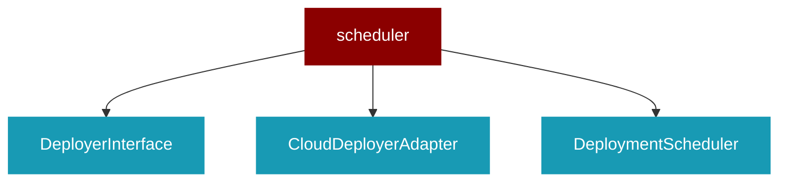

# scheduler

<Badge color="purple">Wrapper</Badge>

## Overview



DEPRECATED: This module is deprecated. Use praisonai.scheduler instead.

This file is kept for backward compatibility only.
All new code should import from praisonai.scheduler.

## Import

```python
from praisonai import scheduler
```

## Classes

### DeployerInterface

*Extends: ABC*

Abstract interface for deployers to ensure provider compatibility.

#### Methods

##### deploy() -> bool

Execute deployment. Returns True on success, False on failure.

---

### CloudDeployerAdapter

*Extends: DeployerInterface*

Adapter for existing CloudDeployer to match interface.

#### Methods

##### deploy() -> bool

Execute deployment using CloudDeployer.

---

### DeploymentScheduler

Minimal deployment scheduler with provider-agnostic design.

Features:
- Simple interval-based scheduling
- Thread-safe operation
- Extensible deployer factory pattern
- Minimal dependencies

<Expandable title="Constructor Parameters">

<ParamField query="schedule_config" type="Optional">
   (default: `None`)
</ParamField>

</Expandable>

#### Methods

##### set_deployer(deployer: DeployerInterface) -> Any

Set custom deployer implementation.

---
##### start(schedule_expr: str, max_retries: int) -> bool

Start scheduled deployment.

Args:
    schedule_expr: Schedule expression (e.g., "daily", "*/6h", "3600")
    max_retries: Maximum retry attempts on failure
    
Returns:
    True if scheduler started successfully

---
##### stop() -> bool

Stop the scheduler.

---
##### deploy_once() -> bool

Execute a single deployment immediately.

---


## Functions

### create_scheduler()

Factory function to create scheduler for different providers.

Args:
    provider: Deployment provider ("gcp", "aws", "azure", etc.)
    config: Optional configuration dict
    
Returns:
    Configured DeploymentScheduler instance

```python
def create_scheduler(provider: str, config: Optional) -> DeploymentScheduler
```

<Expandable title="Parameters">

<ParamField query="provider" type="str">
</ParamField>
<ParamField query="config" type="Optional">
</ParamField>

</Expandable>

