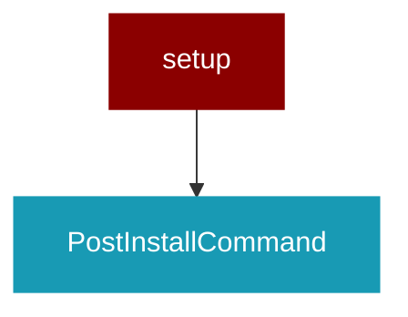

# setup

<Badge color="purple">Wrapper</Badge>

## Overview



## Import

```python
from praisonai import setup
```

## Classes

<AccordionGroup>
### PostInstallCommand

*Extends: install*

<AccordionGroup>
<Accordion title="run() -> Any">
</Accordion>
</AccordionGroup>

</AccordionGroup>
