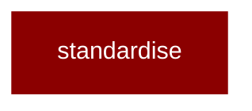

# standardise

<Badge color="purple">Wrapper</Badge>

## Overview



PraisonAI Standardise Module

Feature Docs/Examples Protocol (FDEP) implementation for standardising
documentation and examples across the PraisonAI ecosystem.

All imports are lazy-loaded for zero performance impact.

## Import

```python
from praisonai import standardise
```
