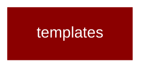

# templates

<Badge color="purple">Wrapper</Badge>

## Overview



PraisonAI Templates Module

Provides template loading, caching, and resolution for Agent/Workflow configurations.
All imports are lazy to ensure zero performance impact when not used.

## Import

```python
from praisonai import templates
```
