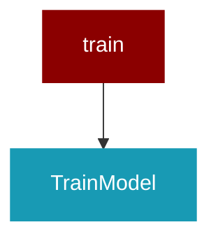

# train

<Badge color="purple">Wrapper</Badge>

## Overview



This script finetunes a model using Unsloth's fast training framework.
It supports both ShareGPT and Alpaca‑style datasets by converting raw conversation
data into plain-text prompts using a chat template, then pre‑tokenizing the prompts.
Extra debug logging is added to help trace the root cause of errors.

## Import

```python
from praisonai import train
```

## Classes

### TrainModel

<Expandable title="Constructor Parameters">

<ParamField query="config_path" type="Any">
   (default: `'config.yaml'`)
</ParamField>

</Expandable>

#### Methods

##### load_config(path: Any) -> Any
---
##### print_system_info() -> Any
---
##### check_gpu() -> Any
---
##### check_ram() -> Any
---
##### prepare_model() -> Any
---
##### process_dataset(dataset_info: Any) -> Any
---
##### tokenize_dataset(dataset: Any) -> Any
---
##### load_datasets() -> Any
---
##### train_model() -> Any
---
##### inference(instruction: Any, input_text: Any) -> Any
---
##### load_model() -> Any
---
##### save_model_merged() -> Any
---
##### push_model_gguf() -> Any
---
##### save_model_gguf() -> Any
---
##### prepare_modelfile_content() -> Any
---
##### create_and_push_ollama_model() -> Any
---
##### run() -> Any
---


## Functions

### formatting_prompts_func()

Converts each example's conversation into a single plain-text prompt.
If the example has a "conversations" field, process it as ShareGPT-style.
Otherwise, assume Alpaca-style data with "instruction", "input", and "output" fields.

```python
def formatting_prompts_func(examples: Any, tokenizer: Any) -> Any
```

<Expandable title="Parameters">

<ParamField query="examples" type="Any">
</ParamField>
<ParamField query="tokenizer" type="Any">
</ParamField>

</Expandable>

### tokenize_function()

Tokenizes a batch of text prompts with padding and truncation enabled.

```python
def tokenize_function(examples: Any, hf_tokenizer: Any, max_length: Any) -> Any
```

<Expandable title="Parameters">

<ParamField query="examples" type="Any">
</ParamField>
<ParamField query="hf_tokenizer" type="Any">
</ParamField>
<ParamField query="max_length" type="Any">
</ParamField>

</Expandable>

### main()

```python
def main() -> Any
```

