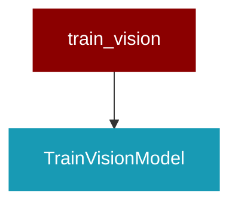

# train_vision

<Badge color="purple">Wrapper</Badge>

## Overview



This script finetunes a vision language model using Unsloth's fast training framework.
It supports vision tasks by converting raw image-caption samples into a conversation format, 
adding vision-specific LoRA adapters, and training using TRL's SFTTrainer with UnslothVisionDataCollator.

## Import

```python
from praisonai import train_vision
```

## Classes

<AccordionGroup>
### TrainVisionModel

<Expandable title="Constructor Parameters">

<ParamField query="config_path" type="Any">
   (default: `'config.yaml'`)
</ParamField>

</Expandable>

<AccordionGroup>
<Accordion title="load_config(path: Any) -> Any">
</Accordion>
<Accordion title="print_system_info() -> Any">
</Accordion>
<Accordion title="check_gpu() -> Any">
</Accordion>
<Accordion title="check_ram() -> Any">
</Accordion>
<Accordion title="prepare_model() -> Any">
</Accordion>
<Accordion title="convert_sample(sample: Any) -> Any">
</Accordion>
<Accordion title="load_datasets() -> Any">
</Accordion>
<Accordion title="train_model() -> Any">
</Accordion>
<Accordion title="vision_inference(instruction: Any, image: Any) -> Any">
</Accordion>
<Accordion title="save_model_merged() -> Any">
</Accordion>
<Accordion title="push_model_gguf() -> Any">
</Accordion>
<Accordion title="save_model_gguf() -> Any">
</Accordion>
<Accordion title="prepare_modelfile_content() -> Any">
</Accordion>
<Accordion title="create_and_push_ollama_model() -> Any">
</Accordion>
<Accordion title="run() -> Any">
</Accordion>
</AccordionGroup>

</AccordionGroup>

## Functions

<AccordionGroup>
### main()

```python
def main() -> Any
```

</AccordionGroup>
