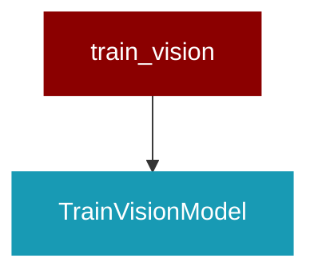

# train_vision

<Badge color="purple">Wrapper</Badge>

## Overview



This script finetunes a vision language model using Unsloth's fast training framework.
It supports vision tasks by converting raw image-caption samples into a conversation format, 
adding vision-specific LoRA adapters, and training using TRL's SFTTrainer with UnslothVisionDataCollator.

## Import

```python
from praisonai import train_vision
```

## Classes

### TrainVisionModel

<Expandable title="Constructor Parameters">

<ParamField query="config_path" type="Any">
   (default: `'config.yaml'`)
</ParamField>

</Expandable>

#### Methods

##### load_config(path: Any) -> Any
---
##### print_system_info() -> Any
---
##### check_gpu() -> Any
---
##### check_ram() -> Any
---
##### prepare_model() -> Any
---
##### convert_sample(sample: Any) -> Any
---
##### load_datasets() -> Any
---
##### train_model() -> Any
---
##### vision_inference(instruction: Any, image: Any) -> Any
---
##### save_model_merged() -> Any
---
##### push_model_gguf() -> Any
---
##### save_model_gguf() -> Any
---
##### prepare_modelfile_content() -> Any
---
##### create_and_push_ollama_model() -> Any
---
##### run() -> Any
---


## Functions

### main()

```python
def main() -> Any
```

