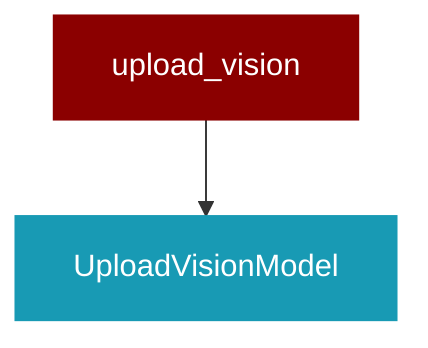

# upload_vision

<Badge color="purple">Wrapper</Badge>

## Overview



This script handles uploading trained vision models to Hugging Face and Ollama.
It reads configuration from config.yaml and provides options to upload in different formats.

## Import

```python
from praisonai import upload_vision
```

## Classes

<AccordionGroup>
### UploadVisionModel

<Expandable title="Constructor Parameters">

<ParamField query="config_path" type="Any">
   (default: `'config.yaml'`)
</ParamField>

</Expandable>

<AccordionGroup>
<Accordion title="load_config(path: Any) -> Any">
  Load configuration from yaml file.
</Accordion>
<Accordion title="prepare_model() -> Any">
  Load the trained model for uploading.
</Accordion>
<Accordion title="save_model_merged() -> Any">
  Save merged model to Hugging Face Hub.
</Accordion>
<Accordion title="push_model_gguf() -> Any">
  Push model in GGUF format to Hugging Face Hub.
</Accordion>
<Accordion title="prepare_modelfile_content() -> Any">
  Prepare Ollama modelfile content using Llama 3.2 vision template.
</Accordion>
<Accordion title="create_and_push_ollama_model() -> Any">
  Create and push model to Ollama.
</Accordion>
<Accordion title="upload(target: Any) -> Any">
  Upload the model to specified targets.
Args:
    target (str): One of 'all', 'huggingface', 'huggingface_gguf', or 'ollama'
</Accordion>
</AccordionGroup>

</AccordionGroup>

## Functions

<AccordionGroup>
### main()

```python
def main() -> Any
```

</AccordionGroup>
